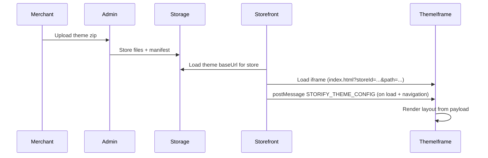
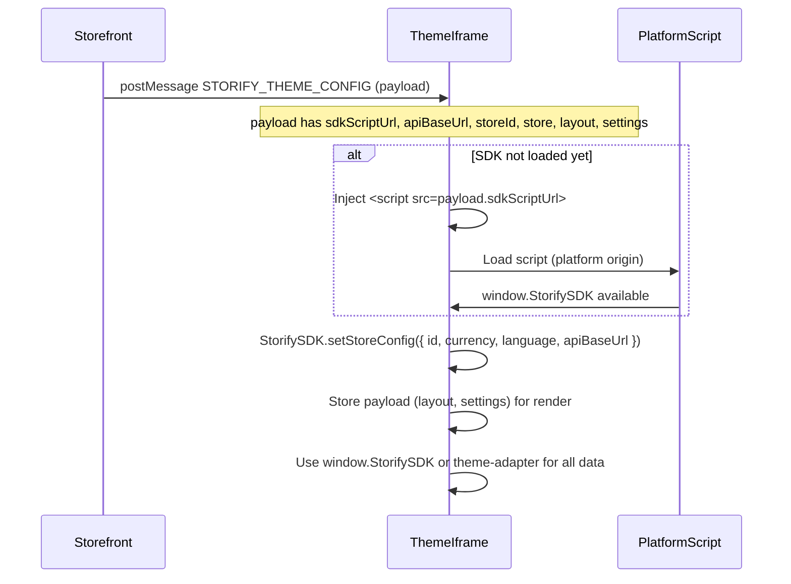

## تجهيز الثيم للرفع (Storify)

1. بناء الثيم وملف الرفع:
   ```bash
   npm run zip
   ```
2. الناتج: **`srab-theme.zip`** في مجلد الثيم (محتويات `dist/` في جذر الـ zip).
3. من لوحة تحكم Storify: **الثيمات المرفوعة** → رفع ثيم → اختر `srab-theme.zip` → بعد الرفع اختر «استخدام هذا الثيم» للمتجر.

## Theme control & preview

- **Theme manifest**: الثيم يعرّف كل الأقسام والصفحات المنطقية عبر الملف `theme-manifest.json` (الأقسام في الحقل `sections[]`، والصفحات في الحقل `pages[]` مثل `home`, `shop`, `product`).
- **Page defaults**: المحتوى الافتراضي لكل صفحة يعرّف في ملفات JSON داخل `config/pages/`، حيث يكون اسم الملف قبل `.json` هو `page id`:
  - `config/pages/home.json` لمحتوى الصفحة الرئيسية.
  - `config/pages/shop.json` لمحتوى صفحة المتجر.
  - `config/pages/product.json` لمحتوى صفحة تفاصيل المنتج.
- عند بناء الثيم ورفعه كـ zip، يقوم النظام بدمج هذه الملفات في `pageDefaults` داخل الـ manifest، بحيث تظهر للمستخدم كقيم أولية في محرر الثيم على Storify.
- محاكيات الإعدادات مثل محاكي الثيم (`ThemeApp` + `StorifySimulator` و `SettingsSimulator`) تساعدك على معاينة شكل الأقسام محلياً، بينما التحكم الحقيقي في المتجر يكون من خلال لوحة تحكم Storify اعتماداً على نفس الـ manifest وملفات `config/pages`.


# Storify Theme Developer Guide — Complete (single file)

This document merges **all** Markdown (`.md`) files from `docs/theme-developer-guide/` into one file for offline reading, printing, or sharing with an LLM.

**Also in this folder (not embedded here):** `theme-manifest.schema.json` — JSON Schema for `theme-manifest.json`; use it in your editor for validation.

---

## Source: `README.md`

# Storify Theme Developer Guide

This guide is for **external developers** who build themes outside the Storify platform. It covers everything you need to create, package, and run a theme that integrates with Storify storefronts: manifest format, packaging, upload, runtime config (postMessage), editor field types, Storefront SDK, public APIs, page defaults, and examples.

**All documentation in this folder is in English.**

---

## Prerequisites

- Basic HTML/JavaScript or a framework (e.g. React, Vue) for the theme UI.
- Ability to produce a **zip file** containing your built theme (e.g. `dist/` output).
- Familiarity with REST APIs and request headers (e.g. `X-Store-Id` for multi-store).

---

## Table of Contents

| Document | Description |
|----------|-------------|
| [01-OVERVIEW.md](01-OVERVIEW.md) | What a Storify theme is, how it loads (iframe), and high-level data flow. |
| [02-MANIFEST.md](02-MANIFEST.md) | Full `theme-manifest.json` reference: required/optional fields, sections, pages. |
| [03-EDITOR-FIELD-TYPES.md](03-EDITOR-FIELD-TYPES.md) | All field types for `contentSchema` and `themeSettingsSchema` with examples. |
| [04-PACKAGE-AND-UPLOAD.md](04-PACKAGE-AND-UPLOAD.md) | Zip layout, size limits, upload via admin, and "Update (code only)" flow. |
| [05-RUNTIME-CONFIG.md](05-RUNTIME-CONFIG.md) | How the theme receives config: postMessage `STORIFY_THEME_CONFIG` payload. |
| [06-STOREFRONT-SDK.md](06-STOREFRONT-SDK.md) | Hooks and helpers: products, cart, wishlist, reviews, categories, menus, store config, formatPrice, prepareProductDescription, setStoreConfig. |
| [06b-INTEGRATION-FLOW.md](06b-INTEGRATION-FLOW.md) | **Correct integration flow (بدل ملف SDK):** step-by-step (listen → load script → setStoreConfig → use SDK), do-not-do list, checklist. |
| [06a-STOREFRONT-SDK-REFERENCE.md](06a-STOREFRONT-SDK-REFERENCE.md) | Full SDK API reference (signatures, types, examples). |
| [STOREFRONT_SDK_PLAN.md](STOREFRONT_SDK_PLAN.md) | SDK plan: file layout, contract, and what themes must use. |
| [07-PAGES-AND-ROUTES.md](07-PAGES-AND-ROUTES.md) | Themed iframe vs platform-fixed routes (`/checkout`, `/order-success`); SPA behavior via `payload.path`. |
| [08-PAGE-DEFAULTS.md](08-PAGE-DEFAULTS.md) | Optional `config/pages/*.json` in the zip and how they are merged. |
| [09-EXAMPLES.md](09-EXAMPLES.md) | Load SDK from platform, theme adapter (استيراد واحد), minimal/multi-section theme, menu, repeater, featured product + cart (E مع E2 بالـ adapter), product grid, reviews/wishlist, local preview. |
| [10-API-REFERENCE.md](10-API-REFERENCE.md) | Public API endpoints: bootstrap, products, menus, store config, etc. |
| [11-CHECKLIST.md](11-CHECKLIST.md) | Pre-submission checklist for theme developers. |
| [12-TROUBLESHOOTING.md](12-TROUBLESHOOTING.md) | Common runtime/build/upload issues and how to fix them quickly. |

**Schema:** [theme-manifest.schema.json](theme-manifest.schema.json) — JSON Schema for `theme-manifest.json` (optional; use in your editor for validation).

---

## Quick start

1. Create a `theme-manifest.json` at the root of your built output with `name`, `version`, `entry`, and `sections`.
2. Build your theme (e.g. `dist/`) and zip its contents (root must include `theme-manifest.json` and the file pointed to by `entry`).
3. Upload the zip via the merchant admin: **Theme Library → Upload theme (zip)**.
4. With an **uploaded theme** (`baseUrl` set), your theme runs in a **single full-screen iframe** for every storefront route that uses the theme (home, shop, product, wishlist, etc.). It is **not** used on `/checkout` or `/order-success` (those stay platform pages). The parent sends **layout**, **settings**, **storeId**, **store**, **path**, optional **cart**, and optionally **products** / **categories** / **currentProduct** via postMessage: `type: "STORIFY_THEME_CONFIG"`. When the customer navigates, the iframe URL and the payload update; your app should react to **payload.path** (and **productId** on product pages).
5. **Load the SDK from the platform** when `payload.sdkScriptUrl` is set: inject that script (the platform serves it for security). **On localhost parents**, the host may omit `sdkScriptUrl` (cross-origin script loading); then bundle the SDK for local dev or load it from a known URL. Then call **StorifySDK.setStoreConfig** with `payload.storeId`, `payload.store` (currency, language), and **payload.apiBaseUrl** (the host points this at the unified API when needed for cross-origin iframes).
6. Use **window.StorifySDK** for all data and formatting (getProducts, formatPrice, cart, wishlist, reviews, etc.). **You do not need a file named storefront-sdk.ts or any SDK file in your theme** — no constants.ts, no custom API layer. Optionally copy the **theme-adapter** folder from the repo for a single import (hooks + helpers); see [06-STOREFRONT-SDK.md](06-STOREFRONT-SDK.md).

---

## Recommended reading order

For complete implementation, read in this order:

1. **Architecture and constraints:** [01-OVERVIEW.md](01-OVERVIEW.md), [07-PAGES-AND-ROUTES.md](07-PAGES-AND-ROUTES.md)
2. **Manifest and editor schemas:** [02-MANIFEST.md](02-MANIFEST.md), [03-EDITOR-FIELD-TYPES.md](03-EDITOR-FIELD-TYPES.md)
3. **Packaging and runtime integration:** [04-PACKAGE-AND-UPLOAD.md](04-PACKAGE-AND-UPLOAD.md), [05-RUNTIME-CONFIG.md](05-RUNTIME-CONFIG.md)
4. **Data and APIs:** [06-STOREFRONT-SDK.md](06-STOREFRONT-SDK.md), [10-API-REFERENCE.md](10-API-REFERENCE.md)
5. **Defaults and production readiness:** [08-PAGE-DEFAULTS.md](08-PAGE-DEFAULTS.md), [09-EXAMPLES.md](09-EXAMPLES.md), [11-CHECKLIST.md](11-CHECKLIST.md), [12-TROUBLESHOOTING.md](12-TROUBLESHOOTING.md)

---

## Scope reminder

- **Uploaded theme iframe** covers the themed storefront routes (same shell as `StoreFront`: `/`, `/shop`, `/product/:id`, `/wishlist`, …). It does **not** replace **`/checkout`** or **`/order-success`**.
- **Checkout and order-success are platform-owned** and cannot be overridden by a theme.
- **Runtime source of truth is postMessage** (`STORIFY_THEME_CONFIG`), not a custom theme config endpoint.
- **Use the Storefront SDK** for store data and formatting; the SDK sends `X-Store-Id` and provides formatPrice, prepareProductDescription, useWishlist, useReviews, etc. Do not build a separate API layer in the theme.


---

## Source: `01-OVERVIEW.md`

# Overview

## What is a Storify theme?

A **Storify theme** is a self-contained storefront UI (HTML, JS, CSS, and optionally a framework like React) that:

- Is defined by a **theme manifest** (`theme-manifest.json`) describing name, version, entry script, and **sections** (e.g. hero, featured products, footer).
- Can define **theme-level settings** (e.g. accent color, menus) and **per-section content** (e.g. title, image, CTA link) that merchants edit in the Storify theme editor.
- Is **uploaded as a zip** by the store owner (or you) via the admin panel and stored in the platform’s storage (e.g. Cloudflare R2).
- When activated with a **`baseUrl`** (uploaded theme), is loaded in a **full-viewport iframe** for all themed storefront routes (home, shop, product, wishlist, policies, …). **`/checkout`** and **`/order-success`** are always platform pages — your theme iframe is not shown there.

## How the theme is loaded



- When a store has an **uploaded theme** (a theme with a `baseUrl`), the storefront embeds one **iframe** for themed routes. The iframe `src` includes `storeId`, **`path`** (current storefront pathname), and on product pages **`productId`**.
- Your theme app runs inside this iframe. It does **not** need to fetch layout/settings from a separate config API; the parent sends **postMessage** with type `STORIFY_THEME_CONFIG` containing `layout`, `settings`, `storeId`, `store`, **`path`**, optional **`cart`**, optional **`products`** / **`categories`** / **`currentProduct`**, **`sdkScriptUrl`**, and **`apiBaseUrl`** (see [05-RUNTIME-CONFIG.md](05-RUNTIME-CONFIG.md)).

## Data flow (high level)

1. **Upload** — Merchant uploads a zip; backend validates `theme-manifest.json`, optionally merges `config/pages/*.json` into `pageDefaults`, stores all files under a theme prefix, and creates an `UploadedTheme` record with `baseUrl`.
2. **Activate** — Merchant clicks “Activate” (use) for a theme; backend builds default layout/pages from manifest + pageDefaults and saves theme instance config for that store.
3. **Storefront load** — Storefront gets theme + config (e.g. via `GET /api/bootstrap`); when an uploaded theme has `baseUrl`, it renders the iframe for themed routes and posts `STORIFY_THEME_CONFIG` whenever the iframe is ready or the route changes.
4. **Theme runtime** — Load the **Storefront SDK** from `payload.sdkScriptUrl` when the host provides it; otherwise use a dev/bundled SDK (common on localhost). Call **StorifySDK.setStoreConfig** with storeId, store (currency, language), and **apiBaseUrl**, then render from **payload.layout** and **payload.path**. Use **window.StorifySDK** for data and formatting; optionally post messages to the parent to sync cart or open the host cart (see [05-RUNTIME-CONFIG.md](05-RUNTIME-CONFIG.md)).

## Routes: theme vs platform

| Route | Handled by |
|-------|------------|
| **Themed routes** (`/`, `/shop`, `/product/:id`, `/wishlist`, `/track-order`, `/about`, `/contact`, `/profile`, `/policies/:slug`, `/cart`, `/collection`, …) | **Uploaded theme iframe** when `baseUrl` is set — same `index.html`, payload updates with **`path`**. |
| **`/checkout`** | Platform only (Checkout component; theme iframe not used). |
| **`/order-success`** | Platform only (theme iframe not used). |

Design your iframe app as a **small SPA**: listen for `STORIFY_THEME_CONFIG`, branch UI on **`payload.path`** / **`payload.productId`**, and keep using the SDK for APIs. Checkout and order confirmation stay on the platform.

## What you need to implement

- **Build output** that includes `theme-manifest.json` at the root and the file referenced by `entry` (e.g. `dist/assets/main-xxx.js`).
- **`index.html`** that loads your entry script and listens for `message` events.
- **Message handler** that loads the SDK from `payload.sdkScriptUrl` when present, then calls **StorifySDK.setStoreConfig** with `id`, `currency`, `language`, and `apiBaseUrl`. On localhost the parent may omit `sdkScriptUrl`; use a bundled SDK or documented dev URL in that case.
- **Section renderer(s)** that map section **`id`**, **`type`**, and optional **`manifestId`** to your components and render using `content` and `settings` — layout may include header/footer groups plus page templates depending on **`payload.path`**.
- **Data and formatting:** Use **window.StorifySDK** (getProducts, formatPrice, prepareProductDescription, cart, wishlist, reviews, etc.). You do **not** need a file named `storefront-sdk.ts` or any SDK file in your theme; the platform serves the SDK. Optionally copy the **theme-adapter** folder for one import (hooks and helpers); see [06-STOREFRONT-SDK.md](06-STOREFRONT-SDK.md).

Next: [02-MANIFEST.md](02-MANIFEST.md) for the full manifest reference.


---

## Source: `02-MANIFEST.md`

# Theme Manifest Reference

The **theme manifest** is a JSON file named `theme-manifest.json` that must be at the **root of your theme package** (same level as `index.html` inside the zip). It describes the theme’s identity, entry script, sections, optional pages, and theme-level settings schema.

You can validate your manifest against the JSON Schema in this folder: [theme-manifest.schema.json](theme-manifest.schema.json).

---

## Required fields

| Field | Type | Description |
|-------|------|-------------|
| `name` | string | Theme name (shown in the admin theme library). |
| `version` | string | Theme version (e.g. `"1.0.0"`). |
| `entry` | string | Path to the main JavaScript bundle, relative to the theme root (e.g. `assets/main-xxx.js`). |
| `sections` | array | List of section definitions (see below). At least one section; max 100. |

---

## Optional fields

| Field | Type | Description |
|-------|------|-------------|
| `themeSettingsSchema` | object | Schema for theme-level settings (colors, menus, etc.). Same field types as section `contentSchema`. Prefer this over `settingsSchema` for new themes. |
| `settingsSchema` | object | Legacy alias for theme-level settings; use `themeSettingsSchema` for new themes. |
| `manifestVersion` | number | Manifest format version (e.g. `1` for current). |
| `languages` | string[] | Supported locale codes (e.g. `["ar", "en"]`). |
| `assets` | object | Default asset paths (e.g. `{ "default_logo": "assets/logo.png" }`). |
| `pages` | array | (DSL) Explicit page definitions: `id`, `type`, `path`, and `layout` (array of section placement items). See Page definitions below. |
| `pageDefaults` | object | Per-page default content keyed by page id, then layout handle (usually merged automatically from `config/pages/*.json` on upload). |

---

## Section shape

Each item in `sections` has:

| Field | Type | Required | Description |
|-------|------|----------|-------------|
| `id` | string | Yes | Unique section id (e.g. `hero`, `featured_products`). |
| `name` | string | Yes | Display name in the theme editor (merchant can override; stored as `customName`). |
| `component` | string | Yes | Component identifier (for your own mapping in the theme; e.g. `HERO`, `SLIDESHOW`). |
| `order` | number | No | Default sort order (lower = higher on page). |
| `group` | string | No | One of `header_group`, `template_group`, `overlay_group`, `footer_group`. Used by the editor to group sections. |
| `allowedPages` | string[] | No | (DSL) Page ids this section can appear on (e.g. `["home", "product"]`). |
| `contentSchema` | object | No | Schema for section content fields (title, image, link, etc.). Keys = field names; values = editor field definitions. See [03-EDITOR-FIELD-TYPES.md](03-EDITOR-FIELD-TYPES.md). |
| `defaultContent` | object | No | Default values for `contentSchema` fields. |

### Example section

```json
{
  "id": "hero",
  "name": "Hero Banner",
  "component": "HERO",
  "order": 0,
  "group": "template_group",
  "allowedPages": ["home"],
  "contentSchema": {
    "title": { "type": "text", "label": "Title", "localizable": true },
    "subtitle": { "type": "textarea", "label": "Subtitle" },
    "image": { "type": "image", "label": "Background image", "aspectRatio": "landscape" },
    "cta_link": { "type": "link", "label": "Button link", "default": "/shop" }
  },
  "defaultContent": {
    "title": "Welcome to our store",
    "subtitle": "Shop the latest collection.",
    "cta_link": "/shop"
  }
}
```

---

## Page definitions (DSL)

When using the `pages` array (DSL format), each page has:

| Field | Type | Description |
|-------|------|-------------|
| `id` | string | Page id (e.g. `home`, `shop`, `product`). |
| `type` | string | Page type (e.g. `home`, `collection`, `product`). |
| `path` | string | URL path (e.g. `/` for home). |
| `layout` | array | List of section placements. Each item: `sectionId` (references `sections[].id`), `handle` (unique handle for this section instance on this page, e.g. `home_hero`), and optionally `defaultEnabled` (boolean). |

### Example pages array

```json
{
  "pages": [
    {
      "id": "home",
      "type": "home",
      "path": "/",
      "layout": [
        { "sectionId": "header", "handle": "home_header", "defaultEnabled": true },
        { "sectionId": "hero", "handle": "home_hero", "defaultEnabled": true },
        { "sectionId": "featured", "handle": "home_featured", "defaultEnabled": true },
        { "sectionId": "footer", "handle": "home_footer", "defaultEnabled": true }
      ]
    }
  ]
}
```

The storefront builds a **merged layout per route** for uploaded themes: shared sections (e.g. header/footer from the home layout) plus **page-specific** sections from `manifest.pages` (e.g. shop, product) when the merchant configures them. The parent sends the result in **`STORIFY_THEME_CONFIG`** with **`payload.path`** so your iframe app knows which logical page is active. See [07-PAGES-AND-ROUTES.md](07-PAGES-AND-ROUTES.md).

---

## Theme-level settings (themeSettingsSchema)

Use the same [editor field types](03-EDITOR-FIELD-TYPES.md) as in section `contentSchema`. Typical use: accent color, number of products per row, and **menu** fields for header/footer navigation. Values are sent in the postMessage payload under `payload.settings`.

Example:

```json
{
  "themeSettingsSchema": {
    "accent_color": { "type": "color", "label": "Accent color", "default": "#6366f1" },
    "nav_primary": { "type": "menu", "label": "Primary navigation" },
    "footer_menu": { "type": "menu", "label": "Footer menu" }
  }
}
```

Menu fields store the menu **handle**. Fetch menu items with `GET /api/menus/by-handle?handle={handle}` and header `X-Store-Id: {storeId}` (see [10-API-REFERENCE.md](10-API-REFERENCE.md)).

---

## contentSchema (per section)

Keys are field names; values are objects with at least `type` and optionally `label`, `description`, `required`, `localizable`, `default`, and type-specific options (e.g. `options` for select, `fields` for repeater). See [03-EDITOR-FIELD-TYPES.md](03-EDITOR-FIELD-TYPES.md) for the full list.

If a section has no `contentSchema` or it is empty, the editor may show a raw JSON editor for that section’s content.

---

## Validation notes

- Backend validates manifest on upload: required fields present, `sections` array length (max 100), and (for DSL) that every `layout[].sectionId` references a section `id`.
- Manifest file size is limited (e.g. 100 KB). Keep `contentSchema` / `themeSettingsSchema` and `defaultContent` reasonable.
- Use `manifestVersion: 1` for the current DSL format so future changes can remain backward compatible.

---

## Compatibility notes

Use this table as a quick compatibility contract:

| Topic | Recommended now | Backward compatibility |
|------|------------------|------------------------|
| Theme settings schema key | `themeSettingsSchema` | `settingsSchema` is still accepted as legacy alias. |
| Manifest DSL version | `manifestVersion: 1` | Missing `manifestVersion` may still work for simple manifests, but `1` is recommended for explicit compatibility. |
| Page defaults | `config/pages/*.json` merged into `pageDefaults` | Direct `pageDefaults` in manifest is also accepted if produced by your build pipeline. |
| Section grouping | `group` in (`header_group`, `template_group`, `overlay_group`, `footer_group`) | If absent, rendering order falls back to numeric `order` and host defaults. |

If you are upgrading an older theme, keep legacy keys temporarily but migrate to current names in the next release to avoid ambiguity.

Next: [03-EDITOR-FIELD-TYPES.md](03-EDITOR-FIELD-TYPES.md) for all supported field types.


---

## Source: `03-EDITOR-FIELD-TYPES.md`

# Editor Field Types

This document lists the **field types** you can use in `contentSchema` (per section) and `themeSettingsSchema` (theme-level settings) in `theme-manifest.json`. The theme editor builds its UI from these definitions.

---

## Common properties (all fields)

| Property | Type | Description |
|----------|------|-------------|
| `type` | string | **Required.** One of the types below. |
| `label` | string | Label shown in the editor. |
| `description` | string | Short help text under the field. |
| `required` | boolean | Whether the field is required. |
| `localizable` | boolean | If true, value can be stored per language. |
| `default` | any | Default value. |

---

## Field types

| Type | Description | Extra properties | Example use |
|------|-------------|------------------|-------------|
| **text** | Single-line text. | `maxLength?: number` | Title, button label. |
| **textarea** | Plain multi-line text. | `maxLength?: number` | Short description. |
| **richtext** | Rich text (headings, lists, links). | — | Article body, policy text. |
| **number** | Numeric value. | `min?`, `max?` | Count, price. |
| **select** | Single choice from a list. | `options`: `{ value, label }[]` or `string[]` | Layout style, language. |
| **multiselect** | Multiple choices. | `options`: same as select | Multiple categories. |
| **color** | Color picker. | — | Accent color, background. |
| **image** | Image from store media. | `aspectRatio?: 'square' \| 'landscape' \| 'portrait' \| 'free'` | Logo, banner. |
| **video** | Video URL or uploaded video. | — | Intro video. |
| **link** | Internal path or external URL. | — | CTA button, footer link. |
| **category** | Single category from the store. | — | “Products from this category” section. |
| **categories** | Multiple categories. | `maxItems?: number` | Multi-category filter. |
| **product** | Single product. | — | Featured product. |
| **products** | Multiple products. | `maxItems?: number` | Hand-picked product list. |
| **menu** | Navigation menu (by handle). | — | Header nav, footer menu. |
| **repeater** | Repeating group of fields. | `fields`, `minItems?`, `maxItems?`, `itemLabel?` | Slideshow slides, testimonials, features. |
| **metafield_mapping** | Map to product/category metafield. | — | Custom product field display. |

---

## Examples (JSON)

### Text and choices

```json
{
  "title": { "type": "text", "label": "Title", "localizable": true },
  "subtitle": { "type": "textarea", "label": "Subtitle", "maxLength": 500 },
  "layout": {
    "type": "select",
    "label": "Layout",
    "options": [
      { "value": "left", "label": "Left" },
      { "value": "center", "label": "Center" }
    ]
  }
}
```

### Media and link

```json
{
  "background_image": { "type": "image", "label": "Background image", "aspectRatio": "landscape" },
  "cta_link": { "type": "link", "label": "Button link" }
}
```

### Store entities

```json
{
  "category": { "type": "category", "label": "Category" },
  "products": { "type": "products", "label": "Featured products", "maxItems": 12 },
  "footer_menu": { "type": "menu", "label": "Footer menu" }
}
```

### Repeater (e.g. features)

```json
{
  "features": {
    "type": "repeater",
    "label": "Features",
    "itemLabel": "Feature",
    "minItems": 0,
    "maxItems": 6,
    "fields": {
      "icon": { "type": "image", "label": "Icon" },
      "title": { "type": "text", "label": "Title", "localizable": true },
      "description": { "type": "richtext", "label": "Description", "localizable": true }
    }
  }
}
```

### Repeater (slideshow)

```json
{
  "slides": {
    "type": "repeater",
    "label": "Slideshow",
    "itemLabel": "Slide",
    "minItems": 0,
    "maxItems": 10,
    "fields": {
      "image": { "type": "image", "label": "Image", "aspectRatio": "landscape" },
      "heading": { "type": "text", "label": "Heading", "localizable": true },
      "subheading": { "type": "text", "label": "Subheading", "localizable": true },
      "buttonText": { "type": "text", "label": "Button text", "localizable": true },
      "cta_link": { "type": "link", "label": "Button link", "default": "/shop" }
    }
  }
}
```

In the editor, repeaters show an “Add [itemLabel]” button and a list of items; each item’s fields are editable. In your theme, you read the value as an array (e.g. `content.slides`) and render one block per item.

---

## Menu fields

You can define **any number** of menu fields with any keys (e.g. `nav_primary`, `footer_col_1`). The editor shows a dropdown of the store’s menus; the saved value is the menu **handle**. In the runtime payload you get `settings.nav_primary`, `settings.footer_col_1`, etc. Use the [Menus API](10-API-REFERENCE.md#menus) with that handle and `X-Store-Id` to fetch menu items and render links.

---

## Notes

- Unknown types may be treated as text or raw JSON by the editor depending on implementation.
- New types may be added in future DSL versions; themes that ignore unknown types remain valid.

Next: [04-PACKAGE-AND-UPLOAD.md](04-PACKAGE-AND-UPLOAD.md) for zip layout and upload.


---

## Source: `04-PACKAGE-AND-UPLOAD.md`

# Package and Upload

## Zip layout

Your theme is delivered as a **zip file**. When unpacked, the root must contain:

- **theme-manifest.json** — the manifest file (required).
- **index.html** — the page loaded in the iframe (typically loads your entry script).
- The file referenced by `manifest.entry` (e.g. `assets/main-xxx.js`) and any other assets (CSS, images, fonts).

Optional:

- **config/pages/** — directory with one JSON file per page (e.g. `home.json`, `shop.json`). See [08-PAGE-DEFAULTS.md](08-PAGE-DEFAULTS.md). Paths like `config/pages/home.json` or `dist/config/pages/home.json` are accepted; the backend merges them into the manifest as `pageDefaults`.

Example structure:

```
my-theme.zip
  theme-manifest.json
  index.html
  assets/
    main-abc123.js
    style.css
  config/
    pages/
      home.json
      shop.json
```

---

## Size limits

- **Total zip size:** 50 MB.
- **Single file inside zip:** 10 MB.

Larger zips or files will be rejected on upload.

---

## Upload flow (merchant)

1. In Storify admin, open Theme Library.
2. Use "Upload theme (zip)" and select your zip file.
3. Backend validates `theme-manifest.json`, optionally merges `config/pages/*.json` into `pageDefaults`, stores all files under a theme prefix (e.g. `themes/{themeId}/`), and creates an UploadedTheme record with `baseUrl`.
4. If page defaults were merged, the response may include `pageDefaultsLoaded` (number of pages).
5. The new theme appears in the library. The merchant can Activate it or Edit it in the theme editor.

Upload is done through the admin UI.

---

## Update (code only)

Storify supports an **Update (code only)** action per theme. This:

- Accepts a new zip file.
- Replaces only the theme dist (JS, CSS, HTML, images, and `theme-manifest.json`).
- Does **not** overwrite store-specific data: layout order, section content, theme settings, and draft are preserved.

Use this when you fix bugs or add features in the theme code without resetting the store layout or settings.

---

## What gets stored

All files from the zip are stored under a single prefix (e.g. `themes/{themeId}/`). The **baseUrl** is the base URL for that prefix. The iframe loads `{baseUrl}index.html?storeId=...`.

Ensure your zip does not use paths with `..`. Invalid paths are skipped during upload.

---

## Build checklist

- Put `theme-manifest.json` at the root of what you zip.
- Ensure `entry` in the manifest points to a path that exists in the zip (e.g. `assets/main.js`).
- Ensure `index.html` loads the entry script.
- If you use `config/pages/*.json`, include them in the zip under a path containing `config/pages/` and ending with `.json` for each page.

Next: [05-RUNTIME-CONFIG.md](05-RUNTIME-CONFIG.md) for how the theme receives config at runtime.


---

## Source: `05-RUNTIME-CONFIG.md`

# Runtime Config

Your theme runs inside an **iframe** on the storefront home page. It receives **layout**, **settings**, **storeId**, and **store** info via a single **postMessage** from the parent. You do not need a separate API call to get this config.

---

## postMessage: STORIFY_THEME_CONFIG

The storefront posts one message type:

- **type:** `"STORIFY_THEME_CONFIG"`
- **payload:** object with the following fields.

### Payload shape

```ts
// Message: window.postMessage from storefront parent to theme iframe
{
  type: "STORIFY_THEME_CONFIG",
  payload: {
    layout: Array<{
      id: string;
      /** Section type from manifest/editor (e.g. HEADER, HERO, SHOP_PAGE). */
      type?: string;
      /** header_group | footer_group | overlay_group | template_group — used when merging shared + page layouts. */
      group?: string;
      /** Manifest section id when distinct from instance id (e.g. `header` vs `header-1`). */
      manifestId?: string;
      customName?: string;
      content?: Record<string, unknown>;
      order: number;
      enabled: boolean;
    }>;
    settings: Record<string, unknown>;  // merged theme + instance + lang overlay
    storeId?: string;
    store?: {
      name: string;
      logo: string;
      favicon: string;
      email: string;
      phone: string;
      address: string;
      metaDescription?: string;
      currency?: string;
      language?: string;
    };
    products?: Array<unknown>;
    /** Host cart snapshot for syncing UI with checkout (shape aligns with storefront cart lines). */
    cart?: Array<unknown>;
    categories?: Array<unknown>;
    /** Current storefront pathname (e.g. `/shop`, `/product/abc`). Drive SPA views from this. */
    path?: string;
    productId?: string;
    currentProduct?: unknown;
    /** Storefront SDK script URL. Omitted when parent is localhost (CDN iframe cannot load `/sdk` from host reliably). */
    sdkScriptUrl?: string;
    /** Absolute API base (e.g. `https://your-store.com/api`). On localhost parents this may target the unified backend directly for cross-origin iframe fetches. */
    apiBaseUrl?: string;
  };
}
```

- **layout** — Sections for the home page, **ordered** as saved by the merchant. Filter by `enabled !== false` and sort by `order`, then render in that order.
- **content** — Per-section content (values from the editor or your `defaultContent`). Menu fields in sections store the menu handle; theme-level menu fields are in `settings`.
- **settings** — Theme-level settings (e.g. accent color, menu handles like `nav_primary`, `footer_menu`). Use these for global UI (header, footer, styles).
- **storeId** — Required for the Storefront SDK; the SDK sends it as `X-Store-Id` on all requests. You must pass it to **setStoreConfig** when you receive the payload.
- **store** — Store name, logo, favicon, contact, **currency**, and **language**. Pass `currency` and `language` to **setStoreConfig** so **formatPrice** and other formatters use the correct locale.
- **products**, **categories**, **currentProduct** — Optional; the host may include them so the theme can render without an extra fetch. For other data use the **Storefront SDK**.
- **cart** — Optional snapshot of the **parent** cart so the iframe UI can match checkout lines; you can still use SDK cart helpers for in-iframe state, and **postMessage** to add/remove on the host (see below).
- **path** — Current browser path on the **storefront** (not the iframe origin). Use this to choose which sections/views to show inside your single-page theme app.
- **sdkScriptUrl** — URL of the SDK script (typically `{storefrontOrigin}/sdk/storefront-sdk.js`). **When omitted** (common with localhost parents), load a **bundled** standalone SDK in dev or follow your team’s documented script URL.
- **apiBaseUrl** — Absolute API base URL. Pass to **setStoreConfig** so the SDK calls the correct API from the cross-origin iframe (the host may set this to the unified backend in local dev).

The message is sent when the iframe loads, **after navigation** (path/product change), and when config changes (e.g. theme editor save). The host may send it multiple times with short delays to catch slow iframe readiness.

---

## Tell the parent when your iframe is ready

After your app can receive `postMessage`, post this to **`window.parent`** (target origin should match the storefront parent you trust, or `*` in dev only):

```ts
window.parent.postMessage({ type: 'STORIFY_THEME_READY' }, '*');
```

The storefront listens for **`STORIFY_THEME_READY`** and re-sends **`STORIFY_THEME_CONFIG`** so the first paint gets data even if the iframe loaded late.

---

## Messages from theme iframe → parent (optional)

The storefront handles these **`type`** values from your iframe (same-origin checks apply):

| type | Purpose |
|------|--------|
| `STORIFY_OPEN_CART` | Opens the host cart drawer / panel. |
| `STORIFY_ADD_TO_CART` | Adds a line to the **host** cart; may include `productId`, `quantity`, `product` snapshot, `suppressHostCartOpen`. |
| `STORIFY_REMOVE_FROM_CART` | Removes from host cart; `productId`, optional `variantId`. |
| `STORIFY_TOGGLE_WISHLIST` | Toggles wishlist on the host; include `product` object. |
| `STORIFY_NEWSLETTER_SUBSCRIBE` | `email` string for newsletter signup. |

Use these when the customer should see the **same** cart and wishlist as on `/checkout` without duplicating checkout logic inside the iframe.

---

## How to subscribe (JavaScript)

**Recommended: load the SDK from the platform** (see [06-STOREFRONT-SDK.md](06-STOREFRONT-SDK.md)). When you receive `STORIFY_THEME_CONFIG`, load the script from `payload.sdkScriptUrl` (if not already loaded), then call **StorifySDK.setStoreConfig** with `id`, `currency`, `language`, and **apiBaseUrl** so the SDK works in the iframe. Store the payload for layout/settings.

```js
function useStorifyThemeConfig() {
  const [config, setConfig] = useState(null);

  useEffect(() => {
    const handler = (event) => {
      if (event.data?.type !== 'STORIFY_THEME_CONFIG' || !event.data.payload) return;
      const p = event.data.payload;

      function applyConfig() {
        if (window.StorifySDK) {
          window.StorifySDK.setStoreConfig({
            id: p.storeId,
            currency: p.store?.currency,
            language: p.store?.language,
            apiBaseUrl: p.apiBaseUrl,
          });
        }
        setConfig(p);
      }

      if (p.sdkScriptUrl && !window.StorifySDK) {
        const script = document.createElement('script');
        script.src = p.sdkScriptUrl;
        script.onload = applyConfig;
        script.onerror = () => setConfig(p); // still use payload for layout
        document.head.appendChild(script);
      } else {
        applyConfig();
      }
    };
    window.addEventListener('message', handler);
    return () => window.removeEventListener('message', handler);
  }, []);

  return config;
}
```

---

## Security and trust boundaries

- Treat `postMessage` payload as external input; always validate required shape before using nested values.
- If your storefront host origin is known and fixed, verify `event.origin` before accepting messages.
- Avoid `dangerouslySetInnerHTML` with raw payload content unless sanitized.
- Never trust `storeId` from arbitrary query params over `payload.storeId` when both exist.

---

## How to render

1. Wait for `config` (show a loading state until the first message).
2. Read **`config.path`** and **`config.productId`** / **`config.currentProduct`** to know which storefront route the customer is on (the layout already reflects merged header/footer + page template when applicable).
3. From `config.layout`, filter items with `enabled !== false` and sort by `order`.
4. For each item, render the section with:
   - `id` — section instance id.
   - **`type`** — section type from manifest/editor (e.g. `HERO`, `SHOP_PAGE`, `HEADER`).
   - **`group`** — `header_group`, `footer_group`, `overlay_group`, or `template_group` (helps you style or order chrome vs page body).
   - `manifestId` — optional manifest section id when different from `id`.
   - `customName ?? id` — display name if needed.
   - `content ?? {}` — section content (titles, images, links, repeater arrays, etc.).
   - `config.settings` — theme settings (colors, menu handles).
   - `config.storeId` — for API calls.
   - `config.store` — for store name, logo, favicon, etc.

Example (React-style):

```js
const enabledSections = (config.layout || [])
  .filter((s) => s.enabled !== false)
  .sort((a, b) => a.order - b.order);

return (
  <div>
    {enabledSections.map((section) => (
      <SectionRenderer
        key={section.id}
        id={section.id}
        content={section.content ?? {}}
        settings={config.settings}
        storeId={config.storeId}
        store={config.store}
      />
    ))}
  </div>
);
```

---

## Bootstrap (storefront side)

The storefront loads theme and config (including uploaded theme layout/settings) via a **bootstrap** API (e.g. `GET /api/bootstrap` with `X-Store-Id`). That response is used to decide the theme’s `baseUrl` and to build the payload sent to your iframe. As a theme developer you do not call the bootstrap API yourself; you only consume the postMessage. Store identification inside the iframe is via `payload.storeId` and (if needed) the same origin or query params (e.g. `?storeId=...`) that the storefront may add to the iframe URL.

---

## Menu handles in payload

If you defined **menu** fields in `themeSettingsSchema` or in a section’s `contentSchema`, the saved value is the menu **handle**. You will see it in `payload.settings` (e.g. `settings.nav_primary`) or in `payload.layout[].content` for that section. To get the actual links, call the menus API: `GET /api/menus/by-handle?handle={handle}` with header `X-Store-Id: {storeId}`. See [10-API-REFERENCE.md](10-API-REFERENCE.md).

---

## Runtime debug quick checks

When a theme does not render as expected:

1. Log first payload once on message receive (`console.debug('theme payload', event.data.payload)`).
2. Confirm **setStoreConfig** is called with `payload.storeId` and `payload.store` (currency, language) so the SDK works correctly.
3. Confirm `layout` is array and has at least one enabled section.
4. Confirm `storeId` is present; the SDK uses it for all API requests (`X-Store-Id`).
5. If sections appear empty, inspect `payload.layout[n].content` and compare field keys with your section component expectations.
6. If prices or locale look wrong, ensure `payload.store?.currency` and `payload.store?.language` are passed to setStoreConfig.

Next: [06-STOREFRONT-SDK.md](06-STOREFRONT-SDK.md) for products, cart, wishlist, reviews, menus, and formatting.


---

## Source: `06-STOREFRONT-SDK.md`

# Storefront SDK

Themes use the **Storefront SDK** as the single source for data and formatting. **Do not bundle the SDK in your theme.** Load it from the platform using `payload.sdkScriptUrl` so the platform controls the code (better security). Then use `window.StorifySDK` for all data and formatting.

**→ Full step-by-step integration (بدل ملف SDK):** [06b-INTEGRATION-FLOW.md](06b-INTEGRATION-FLOW.md) — listen → load script → setStoreConfig → use SDK; plus a "do not do" list and checklist.

---

## You do not need a SDK file in your theme

**External developers:** You do **not** need to create or ship a file named `storefront-sdk.ts` (or `storefront-sdk.js`) in your theme.

| In your theme | Required? |
|---------------|-----------|
| A file called `storefront-sdk.ts` or any SDK source | **No.** The platform serves the SDK script; your theme loads it via `payload.sdkScriptUrl`. |
| `constants.ts` or custom API layer with `apiBaseUrl` / `X-Store-Id` | **No.** The SDK is configured once with `StorifySDK.setStoreConfig`; all requests go through `window.StorifySDK`. |
| **Theme SDK Adapter** (optional) | Copy the `theme-adapter` folder from the Storify repo into your theme if you want one import for hooks and helpers (`useProduct`, `formatPrice`, etc.). See [Theme SDK Adapter](#theme-sdk-adapter-واجهة-موحدة-في-الثيم) below. |

So: **no SDK file in the theme zip** — only load the script from the platform and (optionally) use the adapter for a single import point.

---

## Load SDK from platform (recommended)

The storefront sends **sdkScriptUrl** and **apiBaseUrl** in the `STORIFY_THEME_CONFIG` payload. Load the script once, then call **StorifySDK.setStoreConfig** and use **window.StorifySDK** for everything.

1. When you receive the message, if `payload.sdkScriptUrl` is set and `window.StorifySDK` is not yet defined, add a `<script src={payload.sdkScriptUrl}>` and wait for `onload`. If **`sdkScriptUrl` is missing** (e.g. localhost parent), use a **bundled** standalone build of the SDK for development or a URL your team documents.
2. Then call:
   ```js
   window.StorifySDK.setStoreConfig({
     id: payload.storeId,
     currency: payload.store?.currency,
     language: payload.store?.language,
     apiBaseUrl: payload.apiBaseUrl,
   });
   ```
3. Use **window.StorifySDK** for all data and formatting (see below). No `constants.ts` or custom API layer; no need to put the SDK in your theme zip.

---

## Platform SDK API (window.StorifySDK)

After the script loads, use these (all promise-based or sync; no React required):

| Method | Description |
|--------|-------------|
| **setStoreConfig** | `{ id, currency?, language?, apiBaseUrl? }` — call once when you receive the payload. |
| **getStoreId**, **getApiUrl**, **getStoreSdkConfig** | Config helpers. |
| **formatPrice(price)** | Formatted price string (use for all price display). |
| **prepareProductDescription(html)** | Safe HTML for product description (XSS-safe). |
| **getProducts(query?)**, **getProduct(id)**, **getProductByHandle(handle)** | Products. |
| **getBestSellingProducts(limit)**, **getNewestProducts(limit)**, **getProductsByCollection(id)** | Product lists. |
| **getCategories()**, **getCategory(id)** | Categories. |
| **getMenu(handle)** | Menu items (by handle). |
| **getOrderById(id)** | Order lookup by id (standalone SDK; optional — requires a public `GET` order API when enabled on the backend). |
| **getStoreConfig()**, **getPolicy(slug)** | Store and policy. |
| **getReviews(productId)**, **addReview(productId, { customerName, rating, comment })** | Reviews. |
| **getCartItems()**, **addToCart(product, qty?, variantId?)**, **removeFromCart**, **updateCartQuantity**, **clearCart**, **getCartSubtotal**, **getCartTotalItems** | Cart (in-memory). |
| **getWishlist()**, **toggleWishlist(product)**, **isInWishlist(productId)** | Wishlist (localStorage). |

Example: `const products = await window.StorifySDK.getProducts();` then `window.StorifySDK.formatPrice(p.price)`.

---

## Theme SDK Adapter (واجهة موحّدة في الثيم)

حتى لا يكرر كل سكشن استدعاء `window.StorifySDK` وكتابة `useState`/`useEffect`، يمكن استخدام **Theme SDK Adapter**: طبقة رفيعة داخل الثيم تستورد من مكان واحد.

- **الموقع في المشروع:** `shared/storefront/theme-adapter/` — انسخ مجلد `theme-adapter` إلى مشروع الثيم أو استخدم المسار إن كان الثيم داخل الـ monorepo.
- **ما يصدّره:** `getSDK()`, **useProducts**, **useProduct**, **useCategories**, **useMenu**, **useReviews**, **useCart**, **useWishlist**, **formatPrice**, **prepareProductDescription**, **submitReview**، وأنواع مثل **MenuItem**, **SubmitReviewPayload**, **ProductMinimal**.
- **بدون fetch وبدون apiBaseUrl** — كل الطلبات عبر `window.StorifySDK` فقط. انظر الملف `shared/storefront/theme-adapter/README.md` في المستودع.

مثال استيراد في الثيم:

```ts
import { getSDK, useProduct, useCart, formatPrice, submitReview } from './theme-adapter';
import type { MenuItem, SubmitReviewPayload } from './theme-adapter';
```

---

## Theme iframe setup (if you still bundle the SDK)

If you cannot use the platform script (e.g. local dev without parent), you may bundle the SDK and import **setStoreConfig**. Call it with `id`, `currency`, `language`, and **apiBaseUrl** (from payload) when running in a cross-origin iframe so API requests go to the storefront origin.

---

## Products

- **useProducts(query)** — List products. Query can include search, category, status. Returns `{ products, loading, error }`.
- **useProduct(id)** — Single product by id. Returns `{ product, loading, error }`.
- **useProductByHandle(handle)** — Single product by handle. Returns `{ product, loading, error }`.
- **useBestSellingProducts(limit)** — Best-selling products. Returns `{ products, loading, error }`.
- **useNewestProducts(limit)** — Newest products. Returns `{ products, loading, error }`.
- **useProductsByCollection(collectionId)** — Products in a collection. Returns `{ products, loading, error }`.
- **useProductsBySource(source, limit, collectionId?)** — Source is best_selling, newest, or collection. Returns `{ products, loading, error }`.

---

## Categories

- **useCategories()** — List categories. Returns `{ categories, loading, error }`.
- **useCollectionByHandle(handle)** — Products in a category by handle. Returns `{ products, loading, error }`.

---

## Menus

- **useMenu(handle)** — Menu items by handle. Returns `{ items, loading, error }`. Each item has id, label, url, sortOrder, openInNewTab, depth. Use the handle from payload.settings (e.g. settings.nav_primary) or from section content.

Under the hood this calls `GET /api/menus/by-handle?handle={handle}` with `X-Store-Id`.

---

## Store config

- **useStoreConfig()** — Store configuration (name, logo, favicon, email, phone, address, currency, language, policies). Returns `{ config, loading, error }`.

You also receive a store object in the postMessage payload; use that when you already have it to avoid an extra request.

---

## Policies

- **usePolicy(slug)** — Policy content by slug (e.g. privacy, terms, return-exchange, shipping). Returns `{ policy, loading, error }`. Policy has slug, title, body.

---

## Cart

- **useCart()** — Local cart state. Returns `{ items, addItem, removeItem, updateQuantity, clear, subtotal, totalItems }`. Each item is `{ product, quantity, variantId? }`. When adding a product with a selected variant, pass `addItem(product, quantity, selectedVariant?.id)` so the cart line is keyed by product + variant.

---

## Price formatting

- **formatPrice(price: number)** — Returns a formatted string using the store’s currency and language (from `setStoreConfig`). Use this for all price display; do not use `toFixed(2)` or hardcoded currency symbols in the theme.

---

## Product description (safe HTML)

- **prepareProductDescription(html: string)** — Sanitizes product description HTML for safe display (XSS). Use with `dangerouslySetInnerHTML`; do not render `product.description` raw.

---

## Reviews

- **useReviews(productId)** — List reviews for a product. Returns `{ reviews, loading, error }`.
- **useAddReview()** — Returns `{ addReview, submitting, error }` for form use. `addReview(productId, { customerName, rating, comment })` submits to the public API (requires `setStoreConfig` with store id).
- **addReview(productId, input)** — Submit a review (async). Use when you don’t need the hook.

---

## Wishlist

- **useWishlist()** — Local wishlist keyed by store id. Returns `{ wishlist, toggleWishlist, isInWishlist }`. Persisted in localStorage; newest added first.

---

## SEO

- **useSeo(options)** — Returns `{ title, description, image, url, type }` for the current page. Options include pageType, storeName, storeDescription, storeImage, and optional product, policy, category.

---

## Direct API calls

If you need something not exposed by the SDK, use the same endpoints with base URL and header `X-Store-Id: {storeId}`. Prefer extending the SDK rather than calling the API directly from the theme. See [10-API-REFERENCE.md](10-API-REFERENCE.md).

---

## Full reference

For detailed signatures, parameters, and return types, see [06a-STOREFRONT-SDK-REFERENCE.md](06a-STOREFRONT-SDK-REFERENCE.md).

Next: [07-PAGES-AND-ROUTES.md](07-PAGES-AND-ROUTES.md).


---

## Source: `06b-INTEGRATION-FLOW.md`

# Correct integration flow (بدل ملف SDK)

This page is the **single place** for how to connect your theme to the platform **without** shipping an SDK file. Follow these steps in order.

---

## Flow overview



---

## Step-by-step (الربط الصحيح)

### Step 1: Listen for the message

Subscribe to `message` and filter for `event.data?.type === 'STORIFY_THEME_CONFIG'` and `event.data.payload`. See payload shape in [05-RUNTIME-CONFIG.md](05-RUNTIME-CONFIG.md).

### Step 2: Load the SDK script (if needed)

- If `payload.sdkScriptUrl` is present and `window.StorifySDK` is **not** defined:
  - Create a `<script>` element with `src = payload.sdkScriptUrl`.
  - Append it to `document.head`.
  - Wait for the script’s `onload` (or use a small helper that resolves a Promise on load).
- If **`sdkScriptUrl` is absent** (typical when the storefront parent is **localhost**), use a **bundled** standalone SDK in your build for local testing, or inject a known script URL your team provides.
- If `window.StorifySDK` is already defined (e.g. second message after editor save), skip loading.

Optional: after your app is ready to receive config, post **`{ type: 'STORIFY_THEME_READY' }`** to `window.parent` so the host re-sends the payload (see [05-RUNTIME-CONFIG.md](05-RUNTIME-CONFIG.md)).

### Step 3: Call setStoreConfig

As soon as the SDK is available (after script load, or immediately if it was already there), call:

```js
window.StorifySDK.setStoreConfig({
  id: payload.storeId,
  currency: payload.store?.currency,
  language: payload.store?.language,
  apiBaseUrl: payload.apiBaseUrl,
});
```

This configures the store id, locale (for `formatPrice`), and API base URL for the cross-origin iframe. Call it **once per payload** (e.g. on first load and whenever the config message is received again).

### Step 4: Store the payload for layout/settings

Keep `payload.layout`, `payload.settings`, **`payload.path`**, and optional **`payload.productId`** / **`payload.currentProduct`** in your app state so you can render the correct template for each storefront route (single iframe SPA).

### Step 5: Use the SDK for all data and formatting

- **Either** use `window.StorifySDK` directly:  
  `StorifySDK.getProducts()`, `StorifySDK.getProduct(id)`, `StorifySDK.formatPrice(price)`, `StorifySDK.getMenu(handle)`, etc.
- **Or** copy the **theme-adapter** folder into your theme and import from it:  
  `useProduct`, `useCart`, `formatPrice`, `submitReview`, etc. The adapter still uses `window.StorifySDK` under the hood; no fetch or apiBaseUrl in your theme.

Full API list: [06-STOREFRONT-SDK.md](06-STOREFRONT-SDK.md#platform-sdk-api-windowstorifysdk).  
Complete code example for steps 1–4: [09-EXAMPLES.md](09-EXAMPLES.md) — Example A (Runtime listener).

---

## Do not do (لا تفعل)

| Do not | Instead |
|--------|--------|
| Add a file `storefront-sdk.ts` or `storefront-sdk.js` in your theme | Load the script from `payload.sdkScriptUrl` (platform serves it). |
| Add `constants.ts` (or similar) with `API_BASE_URL`, `STORE_ID`, etc. | Use `StorifySDK.setStoreConfig` once; the SDK uses `payload.storeId` and `payload.apiBaseUrl`. |
| Manually `fetch(…)` with `X-Store-Id` for products, menus, cart, reviews | Use `window.StorifySDK` (or theme-adapter) for all of these. |
| Use `toFixed(2)` or hardcoded currency for prices | Use `StorifySDK.formatPrice(price)`. |
| Use raw `dangerouslySetInnerHTML` with `product.description` | Use `StorifySDK.prepareProductDescription(html)`. |
| Implement your own wishlist/reviews API layer | Use `StorifySDK.getWishlist`, `toggleWishlist`, `getReviews`, `addReview` (or theme-adapter equivalents). |

---

## Checklist

- [ ] Theme listens for `STORIFY_THEME_CONFIG`.
- [ ] If `payload.sdkScriptUrl` and no `window.StorifySDK`, inject script and wait for load.
- [ ] Call `StorifySDK.setStoreConfig({ id, currency, language, apiBaseUrl })` with payload values.
- [ ] Use only `window.StorifySDK` (or theme-adapter) for products, menus, cart, wishlist, reviews, formatPrice, prepareProductDescription.
- [ ] No `storefront-sdk.ts` (or any SDK file) in the theme zip.
- [ ] No `constants.ts` or custom API layer with apiBaseUrl / X-Store-Id.

---

## See also

- [05-RUNTIME-CONFIG.md](05-RUNTIME-CONFIG.md) — Payload shape and optional fields.
- [06-STOREFRONT-SDK.md](06-STOREFRONT-SDK.md) — Platform SDK API and theme-adapter.
- [09-EXAMPLES.md](09-EXAMPLES.md) — Example A (listener + script load + setStoreConfig), E, E2, G, H.


---

## Source: `06a-STOREFRONT-SDK-REFERENCE.md`

# Storefront SDK — Full API Reference

Complete reference for external theme developers. All exports live under one entry (e.g. `shared/storefront/lib/storefront-sdk.ts` or your bundler alias). The SDK is split into modules internally for maintenance; you only need to import from the single entry.

---

## Config (theme iframe)

### setStoreConfig(config)

Call once when your theme receives `STORIFY_THEME_CONFIG` so the SDK can use the store id and format prices correctly.

```ts
setStoreConfig(config: StoreSdkConfig | null): void
```

- **config.id** — Store id; sent as `X-Store-Id` on all API requests.
- **config.currency** — Currency code (e.g. `SAR`, `USD`); used by `formatPrice`.
- **config.language** — Language code (e.g. `ar`, `en`); used by `formatPrice`.
- **config.apiBaseUrl** — Absolute base for API calls (required in cross-origin theme iframes; comes from `STORIFY_THEME_CONFIG`).

Example:

```ts
import { setStoreConfig } from '@storify/storefront-sdk';
if (event.data?.type === 'STORIFY_THEME_CONFIG' && event.data.payload) {
  const p = event.data.payload;
  setStoreConfig({
    id: p.storeId,
    currency: p.store?.currency,
    language: p.store?.language,
    apiBaseUrl: p.apiBaseUrl,
  });
}
```

### getStoreId()

Returns the current store id (from setStoreConfig or dev env). Used internally by the SDK.

```ts
getStoreId(): string | null
```

### formatPrice(price)

Formats a number as currency using the store’s currency and language. Use for all price display; do not use `toFixed(2)` or hardcoded symbols.

```ts
formatPrice(price: number): string
```

Example:

```ts
import { formatPrice, useProduct } from '@storify/storefront-sdk';
const { product } = useProduct(id);
const displayPrice = product ? (product.hasVariants && selectedVariant ? selectedVariant.price : product.price) : 0;
return <span>{formatPrice(displayPrice)}</span>;
```

### prepareProductDescription(html)

Sanitizes product description HTML for safe display (XSS). Use with `dangerouslySetInnerHTML`; do not render `product.description` raw.

```ts
prepareProductDescription(html: string): string
```

Example:

```ts
import { useProduct, prepareProductDescription } from '@storify/storefront-sdk';
const { product } = useProduct(id);
return <div dangerouslySetInnerHTML={{ __html: prepareProductDescription(product?.description || '') }} />;
```

---

## Products

### useProducts(query?)

List products with optional filters.

```ts
useProducts(query?: ProductQuery): { products: Product[]; loading: boolean; error: Error | null }
```

**ProductQuery:** `{ search?: string; category?: string; status?: string }`

### useProduct(id)

Single product by id. Uses initial data from host when available.

```ts
useProduct(id: string | null): { product: Product | null; loading: boolean; error: Error | null }
```

### useProductByHandle(handle)

Single product by handle (slug). Fallback: search by handle string.

```ts
useProductByHandle(handle: string | null): { product: Product | null; loading: boolean; error: Error | null }
```

### useBestSellingProducts(limit?)

Best-selling products.

```ts
useBestSellingProducts(limit?: number): { products: Product[]; loading: boolean; error: Error | null }
```

Default limit: 10.

### useNewestProducts(limit?)

Newest products.

```ts
useNewestProducts(limit?: number): { products: Product[]; loading: boolean; error: Error | null }
```

Default limit: 10.

### useProductsByCollection(collectionId)

Products in a collection (category) by id.

```ts
useProductsByCollection(collectionId: string | null): { products: Product[]; loading: boolean; error: Error | null }
```

### useProductsBySource(source, limit, collectionId?)

Single hook for section product sources.

```ts
useProductsBySource(
  source: 'best_selling' | 'newest' | 'collection',
  limit: number,
  collectionId?: string | null
): { products: Product[]; loading: boolean; error: Error | null }
```

For `source === 'collection'`, `collectionId` is required.

---

## Categories

### useCategories()

List all categories.

```ts
useCategories(): { categories: Category[]; loading: boolean; error: Error | null }
```

### useCollectionByHandle(handle)

Products in a category by handle (slug).

```ts
useCollectionByHandle(handle: string | null): { products: Product[]; loading: boolean; error: Error | null }
```

---

## Menus

### useMenu(handle)

Menu items by handle. Handle comes from payload (e.g. `settings.nav_primary`) or section content.

```ts
useMenu(handle: string | null): { items: MenuItem[]; loading: boolean; error: Error | null }
```

**MenuItem:** `{ id: string; label: string; url: string; sortOrder: number; openInNewTab: boolean; depth: number }`

---

## Store config

### useStoreConfig()

Store configuration (name, logo, favicon, contact, currency, language, policies). Prefer using `payload.store` when you already have it to avoid an extra request.

```ts
useStoreConfig(): { config: StoreConfig | null; loading: boolean; error: Error | null }
```

---

## Policies

### usePolicy(slug)

Policy content by slug (e.g. `privacy`, `terms`, `return-exchange`, `shipping`).

```ts
usePolicy(slug: string | null): { policy: Policy | null; loading: boolean; error: Error | null }
```

**Policy:** `{ slug: string; title?: string; body?: string }`

---

## Cart

### useCart()

Local cart state (no backend). Each line is keyed by product id + variant id.

```ts
useCart(): {
  items: CartItem[];
  addItem: (product: Product, quantity?: number, variantId?: string) => void;
  removeItem: (productId: string, variantId?: string) => void;
  updateQuantity: (productId: string, quantity: number, variantId?: string) => void;
  clear: () => void;
  subtotal: number;
  totalItems: number;
}
```

**CartItem:** `{ product: Product; quantity: number; variantId?: string }`

When the product has variants, pass the selected variant id so the same product with different variants appears as separate lines:

```ts
addItem({ ...product, selectedVariant }, quantity, selectedVariant?.id);
```

Subtotal uses variant price when `variantId` is set.

---

## Reviews

### useReviews(productId)

List reviews for a product (public API). Typically only approved reviews are shown; the API may return all and you filter by `status === 'Approved'` if needed.

```ts
useReviews(productId: string | null): { reviews: Review[]; loading: boolean; error: Error | null }
```

**Review:** `{ id: string; productId: string; customerName: string; rating: number; comment: string; date: string; status: 'Pending' | 'Approved' | 'Rejected' }`

### useAddReview()

Returns a stable submit callback and loading/error state for a review form.

```ts
useAddReview(): { addReview: (productId: string, input: AddReviewInput) => Promise<Review>; submitting: boolean; error: Error | null }
```

**AddReviewInput:** `{ customerName: string; rating: number; comment: string }`

### addReview(productId, input)

Submit a review (async). Requires `setStoreConfig` with store id. Throws on error.

```ts
addReview(productId: string, input: AddReviewInput): Promise<Review>
```

---

## Wishlist

### useWishlist()

Local wishlist, keyed by store id, persisted in localStorage. Newest added first. Use after `setStoreConfig` so the key matches the store.

```ts
useWishlist(): { wishlist: Product[]; toggleWishlist: (product: Product) => void; isInWishlist: (productId: string) => boolean }
```

---

## SEO

### useSeo(options)

Returns meta for the current page. Pure function; no hook deps.

```ts
useSeo(options: {
  pageType: 'home' | 'product' | 'policy' | 'shop' | 'category';
  storeName?: string;
  storeDescription?: string;
  storeImage?: string;
  product?: Product | null;
  policy?: Policy | null;
  category?: Category | null;
}): SeoMeta
```

**SeoMeta:** `{ title: string; description: string; image?: string; url: string; type: 'website' | 'product' | 'article' }`

---

## Initial data (SSR / hydration)

### getInitialData()

Read initial data injected by the host (e.g. product or policy for current page). Hooks use this to avoid duplicate fetches.

```ts
getInitialData(): StorefrontInitialData | null
```

**StorefrontInitialData:** `{ product?: Product; policy?: Policy }`

### setInitialData(data)

Inject initial data. Used by the storefront shell; themes typically do not call this.

```ts
setInitialData(data: StorefrontInitialData | null): void
```

---

## Data types (summary)

- **Product:** id, name, description, image, images, price, compareAtPrice, stock, hasVariants, variants?, options?, selectedVariant?, reviews?, rating?, …
- **ProductVariant:** id, title, price, stock, sku, image?
- **ProductOption:** id, name, values[] — optional; used for display (e.g. Size, Color). Selection is by choosing a variant (variant.id); variant.title often combines option values (e.g. "M / Red").
- **Category:** id, name, slug, description?, image?, productCount
- **StoreConfig:** store identity, logo, favicon, contact, currency, language, policies
- **Review:** id, productId, customerName, rating, comment, date, status

Full TypeScript types are exported from the SDK; use them in your theme for type safety.

---

## File structure (internal)

The SDK is implemented under `shared/storefront/lib/sdk/` in separate modules for maintenance. You do not need to import from these paths; use the single entry (`storefront-sdk` or `lib/storefront-sdk`).

| File | Responsibility |
|------|-----------------|
| config.ts | getStoreId, setStoreConfig, getStoreSdkConfig, getApiUrl |
| fetch.ts | sdkFetch, sdkPost (base URL + X-Store-Id) |
| types.ts | ProductQuery, MenuItem, Policy, CartItem, SeoMeta, StoreSdkConfig, re-exports Product, Category, StoreConfig |
| formatters.ts | formatPrice, prepareProductDescription |
| initial-data.ts | getInitialData, setInitialData |
| products.ts | useProducts, useProduct, useProductByHandle, useBestSellingProducts, useNewestProducts, useProductsByCollection, useProductsBySource |
| categories.ts | useCategories, useCollectionByHandle |
| menu.ts | useMenu |
| store-config.ts | useStoreConfig |
| policy.ts | usePolicy |
| cart.ts | useCart |
| reviews.ts | useReviews, useAddReview, addReview |
| wishlist.ts | useWishlist |
| seo.ts | useSeo |
| index.ts | Re-exports all public API |

See [STOREFRONT_SDK_PLAN.md](STOREFRONT_SDK_PLAN.md) for the full plan and conventions.


---

## Source: `STOREFRONT_SDK_PLAN.md`

# Storefront SDK — خطة كاملة وتوثيق للمبرمجين الخارجيين

هذا المستند يصف هيكل الـ Storefront SDK، تقسيم الملفات، العقد الموحد، وما يجب على الثيمات استخدامه دون استدعاءات API مخصصة.

---

## 1. الأهداف

- **مصدر واحد للبيانات والتنسيق:** الثيم يستخدم الـ SDK فقط (hooks + formatters) ولا يبني طبقة API خاصة.
- **صيانة وتطوير أسهل:** كل مجال (منتجات، تصنيفات، قوائم، سلة، تنسيق، إلخ) في ملف منفصل.
- **عقد ثابت:** أشكال البيانات (Product, Variant, Category, …) وتنسيق الأسعار (formatPrice) موحّد من المنصة.
- **توثيق كامل:** مرجع لكل دالة ومعاملات وقيم الإرجاع وأمثلة للمبرمجين الخارجيين.

---

## 2. هيكل الملفات (تقسيم الـ SDK)

```
shared/storefront/lib/
├── storefront-sdk.ts          # واجهة واحدة: يعيد تصدير كل شيء من sdk/
└── sdk/
    ├── index.ts               # تصدير موحد من كل الوحدات
    ├── config.ts              # قاعدة الـ API، getStoreId، setStoreConfig (للثيم في iframe)
    ├── fetch.ts               # sdkFetch مع X-Store-Id
    ├── types.ts               # أنواع مشتركة (ProductQuery, MenuItem, Policy, CartItem, SeoMeta، إلخ)
    ├── products.ts            # useProducts, useProduct, useProductByHandle, useBestSellingProducts, useNewestProducts, useProductsByCollection, useProductsBySource
    ├── categories.ts          # useCategories, useCollectionByHandle
    ├── menu.ts                # useMenu
    ├── store-config.ts        # useStoreConfig
    ├── policy.ts              # usePolicy
    ├── cart.ts                # useCart
    ├── seo.ts                 # useSeo
    ├── formatters.ts          # formatPrice, useFormatPrice (تنسيق السعر حسب عملة/لغة المتجر)
    └── initial-data.ts        # getInitialData, setInitialData (للـ SSR/hydration)
```

- **storefront-sdk.ts:** يبقى نقطة الدخول الحالية؛ يعيد تصدير كل شيء من `sdk/index.ts` لعدم كسر الاستيرادات الحالية.
- **كل وحدة:** مسؤولة عن مجال واحد؛ يسهل الصيانة وإضافة hooks جديدة لاحقاً.

---

## 3. العقد الموحد للثيمات

### 3.1 مصدر الإعداد (Theme iframe)

- الثيم يستقبل `STORIFY_THEME_CONFIG` ويستخرج `storeId`, `store`, **`apiBaseUrl`**, **`path`**, و`layout` (مع `type` / `group` / `manifestId` عند الحاجة).
- **إلزامي:** عند أول استلام للـ payload يستدعي الثيم `setStoreConfig({ id: payload.storeId, currency: payload.store?.currency, language: payload.store?.language, apiBaseUrl: payload.apiBaseUrl })` حتى الـ SDK يعمل من iframe مختلف المنشأ ويستخدم `formatPrice` بشكل صحيح.
- عند تنقل العميل في الستورفرونت يُعاد إرسال الـ payload مع **`path`** جديد — الثيم يعيد الرسم كـ SPA داخل الـ iframe.
- بعدها كل طلبات الـ SDK تستخدم نفس الـ storeId، و`formatPrice` ينسّق حسب عملة/لغة المتجر.

### 3.2 البيانات

- **المنتجات والتصنيفات والقوائم:** عبر hooks فقط (useProducts, useProduct, useCategories, useMenu, إلخ). لا استدعاء fetch مباشر من الثيم.
- **شكل المنتج:** موثّق في types (Product, ProductVariant). الثيم يعتمد على هذه الحقول فقط (مثلاً product.id, product.name, product.price, product.variants).

### 3.3 التنسيق

- **عرض الأسعار:** حصرياً عبر `formatPrice(price: number)` أو `useFormatPrice()(price)` من الـ SDK. لا استخدام لـ `toFixed(2)` أو رموز عملة مكتوبة يدوياً في الثيم.
- العملة واللغة تأتي من إعداد المتجر (إما من الـ host أو من setStoreConfig بعد قراءة الـ payload).

---

## 4. الوظائف الناقصة والمكتملة

| الوظيفة | الحالة | ملاحظات |
|---------|--------|---------|
| useProducts, useProduct, useProductByHandle | ✅ موجود | |
| useBestSellingProducts, useNewestProducts, useProductsByCollection | ✅ موجود | |
| useProductsBySource | ✅ موجود | |
| useCategories, useCollectionByHandle | ✅ موجود | |
| useMenu | ✅ موجود | |
| useStoreConfig | ✅ موجود | |
| usePolicy | ✅ موجود | |
| useCart | ✅ موجود | useCart.addItem(product, qty, variantId) |
| useSeo | ✅ موجود | |
| getInitialData | ✅ موجود | |
| formatPrice / useFormatPrice | ✅ مكتمل | في formatters.ts |
| setStoreConfig (للثيم) | ✅ مكتمل | في config.ts |
| useReviews / addReview | ✅ مكتمل | في reviews.ts |
| prepareProductDescription | ✅ مكتمل | في formatters.ts (وصف المنتج آمن من XSS) |
| useWishlist | ✅ مكتمل | في wishlist.ts (localStorage، أحدث أولاً) |
| دعم limit في useProducts | 🔶 اختياري | بعض الـ APIs تدعم limit؛ توثيق إن وُجد |
| useTranslations(t) من الـ SDK | 🔶 اختياري | إن رغبتم تعريض t للثيم عبر SDK بدل payload فقط |

---

## 5. توثيق المبرمجين الخارجيين

- **06-STOREFRONT-SDK.md:** نظرة عامة، قاعدة الـ API و storeId، وصف مختصر لكل مجموعة (Products, Categories, Menus, Store config, Policies, Cart, SEO)، **إضافة قسم formatPrice وربط الثيم (setStoreConfig)**، ووصف "لا تبني API خاصاً بالثيم".
- **06a-STOREFRONT-SDK-REFERENCE.md** (مرجع كامل): لكل دالة: التوقيع، المعاملات، نوع الإرجاع، مثال استدعاء، ملاحظات (مثل استخدام selectedVariant مع addItem). يشمل أيضاً أنواع البيانات الرئيسية (Product, ProductVariant, CartItem, إلخ).
- **09-EXAMPLES.md:** يبقى يحتوي مثال "Featured product مع variants + cart" مع استخدام formatPrice من الـ SDK وعدم كتابة toFixed أو عملة يدوية.

---

## 6. ملخص التنفيذ

1. إنشاء مجلد `lib/sdk/` وملفات الوحدات حسب القسم 2.
2. نقل المنطق الحالي من `storefront-sdk.ts` إلى الوحدات المناسبة مع الحفاظ على نفس التوقيعات والتصديرات.
3. إضافة `config.setStoreConfig` و `formatters.formatPrice` (وإن أردتم `useFormatPrice`) وربطها بـ config المتجر.
4. جعل `storefront-sdk.ts` يعيد تصدير كل شيء من `sdk/index.ts`.
5. تحديث 06-STOREFRONT-SDK.md وإضافة 06a-STOREFRONT-SDK-REFERENCE.md.
6. التأكد من أن أمثلة الثيم (مثل 09-EXAMPLES) تستخدم formatPrice وعدم تكرار التنسيق.

بعد هذا يكون الـ SDK موحّداً، مقسّماً لصيانة أسهل، ومُوثّقاً بالكامل للمبرمجين الخارجيين مع عقد ثابت (بما فيه تنسيق السعر) دون أن يكتب الثيم API أو تنسيقاً خاصاً به.


---

## Source: `07-PAGES-AND-ROUTES.md`

# Pages and Routes

## Theme-rendered vs platform routes

When a store uses an **uploaded theme** with a valid **`baseUrl`**, the storefront renders that theme inside a **single full-screen iframe** for almost all customer-facing pages that go through `StoreFront`. The iframe loads **`index.html`** once; the parent keeps it in sync by sending **`STORIFY_THEME_CONFIG`** with an updated **`path`**, **layout**, and optional **product** data when the customer navigates.

**Fixed platform routes** (no theme iframe): **`/checkout`** and **`/order-success`**. Those always use the built-in storefront checkout and order confirmation flows.

---

## Routes where the uploaded theme iframe is used

The parent passes the current pathname in **`payload.path`** (and **`productId`** / **`currentProduct`** on product pages). Your theme should treat the iframe as a **single-page app**: re-render based on `path` and section layout, not on separate HTML routes.

Typical themed paths include:

| Path | Notes |
|------|--------|
| `/` | Home — full section layout from theme instance. |
| `/shop`, `/collection` | Shop listing — layout may merge shared header/footer from home with page template sections. |
| `/product/:id` | Product detail — `payload.productId` and `payload.currentProduct` when available. |
| `/wishlist`, `/cart`, `/about`, `/contact`, `/blog`, `/lookbook`, `/track-order`, `/profile` | Themed when defined in theme pages / defaults. |
| `/policies/:slug` | Policy page — `path` reflects the URL. |

Links such as “Checkout” should continue to point to **`/checkout`** on the **parent** storefront (same top-level origin), not to a route inside the iframe’s origin alone.

---

## Platform-only routes

| Route | Description |
|-------|-------------|
| **`/checkout`** | Checkout — always the platform checkout UI. |
| **`/order-success`** | Order confirmation — always the platform page. |

Your theme must not assume it can replace these URLs. Use normal `<a href="/checkout">` or router navigation to the storefront host for checkout.

---

## Theme editor preview (no iframe)

In the admin **theme editor preview**, the platform may render sections with **`TemplateRenderer`** (same section types, no zip iframe). That path is for editing; production with an uploaded theme uses the iframe + postMessage described in [05-RUNTIME-CONFIG.md](05-RUNTIME-CONFIG.md).

---

## Summary

- **Uploaded theme:** One iframe, many **logical** pages driven by **`payload.path`** and **`STORIFY_THEME_CONFIG`**.
- **Checkout / order-success:** Always platform pages.
- **Data:** Use the [Storefront SDK](06-STOREFRONT-SDK.md) inside the iframe; optionally use **postMessage** to the parent to open the host cart or sync line items (see [05-RUNTIME-CONFIG.md](05-RUNTIME-CONFIG.md)).

Next: [08-PAGE-DEFAULTS.md](08-PAGE-DEFAULTS.md) for optional default content per page.


---

## Source: `08-PAGE-DEFAULTS.md`

# Page Defaults (config/pages)

Instead of relying only on `sections[].defaultContent` in the manifest (one default per section for all pages), you can define **per-page default content** using optional JSON files inside your theme zip under **config/pages/**.

---

## Purpose

- **One file per page** (e.g. `home.json`, `shop.json`, `product.json`).
- File name (without `.json`) = page id matching your manifest `pages[].id` (e.g. `home`, `shop`, `product`).
- Each file is an object: keys = **section handles** (as in `pages[].layout[].handle`, e.g. `home_hero`, `home_featured`), values = **default content** for that section on that page (same shape as `defaultContent` in the manifest).

This lets you ship different default copy or content per page without duplicating section definitions.

---

## Directory structure in the zip

Paths like the following are accepted (any path that contains `config/pages/` and ends with `.json`):

- `config/pages/home.json`
- `dist/config/pages/home.json`

Example:

```
theme.zip
  theme-manifest.json
  index.html
  assets/...
  config/
    pages/
      home.json
      shop.json
      product.json
```

---

## File format

Each key in the JSON file is the **handle** of a section on that page (must match `layout[].handle` for that page in the manifest). The value is the default content object for that section.

Example **home.json**:

```json
{
  "home_header": {},
  "home_hero": {
    "title": "Welcome to our store",
    "subtitle": "Shop with ease.",
    "alignment": "right",
    "buttonText": "Shop now",
    "cta_link": "/shop"
  },
  "home_featured": {
    "title": "Featured products",
    "products_source": "best_selling",
    "count": 4,
    "columns": 4
  },
  "home_footer": {
    "text": "© Your store. All rights reserved.",
    "backgroundColor": "#0f172a",
    "textColor": "#ffffff"
  }
}
```

---

## Merge behavior on upload

When the theme zip is uploaded:

1. The backend reads `theme-manifest.json` and validates it.
2. It scans the zip for any path containing `config/pages/` and ending with `.json`.
3. For each such file, the **filename without .json** is the page id; the **parsed JSON object** is the page’s default content keyed by handle.
4. These are merged into the manifest under **`pageDefaults`**:  
   `manifest.pageDefaults = { home: {...}, shop: {...}, ... }`.
5. The updated manifest (with `pageDefaults`) is stored. When the merchant activates the theme, the platform builds the initial layout and section content from the manifest and `pageDefaults` (and section `defaultContent` where a handle is missing).

So you do not need to duplicate section defaults in every page file; only override where the page should differ.

---

## Build and upload

- Include the `config/pages/` directory in your build output and in the zip (e.g. `cp -r config dist/` then zip the contents of `dist/`).
- After upload, you may see a success message indicating that a number of page configs were merged (e.g. "Theme uploaded. Merged settings for N page(s) from config/pages.").

Next: [09-EXAMPLES.md](09-EXAMPLES.md) for minimal and repeater examples.


---

## Source: `09-EXAMPLES.md`

# Examples

This file provides practical end-to-end snippets you can copy into a starter theme and adapt.

**Recommended:** Load the SDK from the platform (do not bundle it). When you receive `STORIFY_THEME_CONFIG`, load the script from **payload.sdkScriptUrl**, call **StorifySDK.setStoreConfig** with `id`, `currency`, `language`, and **apiBaseUrl**, then use **window.StorifySDK** for all data and formatting (see [06-STOREFRONT-SDK.md](06-STOREFRONT-SDK.md)).

**واجهة موحّدة (Theme SDK Adapter):** لتفادي تكرار `window.StorifySDK` و `useState`/`useEffect` في كل سكشن، انسخ مجلد **theme-adapter** من المشروع (`shared/storefront/theme-adapter/`) إلى ثيمك واستورد منه: **getSDK**, **useProducts**, **useProduct**, **useMenu**, **useCategories**, **useReviews**, **useCart**, **useWishlist**, **formatPrice**, **prepareProductDescription**, **submitReview**، والأنواع. كل الطلبات تبقى عبر المنصة فقط — لا fetch ولا apiBaseUrl في الثيم.

---

## Example A: Minimal theme (single section)

### `theme-manifest.json`

```json
{
  "name": "Starter Minimal",
  "version": "1.0.0",
  "manifestVersion": 1,
  "entry": "assets/main.js",
  "sections": [
    {
      "id": "hero",
      "name": "Hero",
      "component": "HERO",
      "order": 0,
      "contentSchema": {
        "title": { "type": "text", "label": "Title", "default": "Welcome" },
        "subtitle": { "type": "textarea", "label": "Subtitle" },
        "cta_link": { "type": "link", "label": "CTA link", "default": "/shop" }
      },
      "defaultContent": {
        "title": "Welcome",
        "subtitle": "Start shopping now",
        "cta_link": "/shop"
      }
    }
  ]
}
```

### Runtime listener (load SDK from platform, then set config)

When you receive the message, load the SDK script from **payload.sdkScriptUrl** (if present), then call **StorifySDK.setStoreConfig** so the SDK can talk to the storefront API. Store the payload for layout/settings.

```tsx
import { useEffect, useState } from 'react';

type ThemeConfig = {
  layout: Array<{
    id: string;
    type?: string;
    group?: string;
    manifestId?: string;
    content?: Record<string, unknown>;
    order: number;
    enabled: boolean;
  }>;
  settings: Record<string, unknown>;
  storeId?: string;
  store?: { name?: string; logo?: string; currency?: string; language?: string };
  path?: string;
  productId?: string;
  currentProduct?: unknown;
  cart?: unknown[];
  products?: unknown[];
  categories?: unknown[];
  sdkScriptUrl?: string;
  apiBaseUrl?: string;
};

export function useStorifyThemeConfig() {
  const [config, setConfig] = useState<ThemeConfig | null>(null);

  useEffect(() => {
    const onMessage = (event: MessageEvent) => {
      if (event.data?.type !== 'STORIFY_THEME_CONFIG' || !event.data.payload) return;
      const p = event.data.payload as ThemeConfig;

      function applyConfig() {
        if (typeof window.StorifySDK !== 'undefined') {
          window.StorifySDK.setStoreConfig({
            id: p.storeId,
            currency: p.store?.currency,
            language: p.store?.language,
            apiBaseUrl: p.apiBaseUrl,
          });
        }
        setConfig(p);
      }

      if (p.sdkScriptUrl && typeof window.StorifySDK === 'undefined') {
        const script = document.createElement('script');
        script.src = p.sdkScriptUrl;
        script.onload = applyConfig;
        script.onerror = () => setConfig(p);
        document.head.appendChild(script);
      } else {
        applyConfig();
      }
    };
    window.addEventListener('message', onMessage);
    return () => window.removeEventListener('message', onMessage);
  }, []);

  return config;
}
```

### Render flow

```tsx
function App() {
  const config = useStorifyThemeConfig();
  if (!config) return <div>Loading theme...</div>;

  const sections = (config.layout || [])
    .filter((s) => s.enabled !== false)
    .sort((a, b) => a.order - b.order);

  return (
    <main>
      {sections.map((section) => (
        <HeroSection key={section.id} content={section.content || {}} />
      ))}
    </main>
  );
}
```

---

## Example B: Multi-section theme with menu settings

### Manifest excerpt (`themeSettingsSchema` + sections)

```json
{
  "themeSettingsSchema": {
    "accent_color": { "type": "color", "label": "Accent color", "default": "#4f46e5" },
    "nav_primary": { "type": "menu", "label": "Primary navigation" },
    "footer_menu": { "type": "menu", "label": "Footer navigation" }
  },
  "sections": [
    { "id": "header", "name": "Header", "component": "HEADER", "order": 0 },
    { "id": "hero", "name": "Hero", "component": "HERO", "order": 1 },
    { "id": "footer", "name": "Footer", "component": "FOOTER", "order": 99 }
  ]
}
```

### Get menu by handle (use platform SDK)

Use **window.StorifySDK.getMenu(handle)** after the SDK is loaded and setStoreConfig was called. No custom fetch or X-Store-Id; the SDK handles it.

```tsx
// Inside header/footer component: load menu items with React state
const [menuItems, setMenuItems] = useState<Array<{ id: string; label: string; url: string }>>([]);
const menuHandle = String(config.settings?.nav_primary || '');

useEffect(() => {
  if (!menuHandle || typeof window.StorifySDK === 'undefined') {
    setMenuItems([]);
    return;
  }
  window.StorifySDK.getMenu(menuHandle).then((items) => {
    setMenuItems(Array.isArray(items) ? items : []);
  }).catch(() => setMenuItems([]));
}, [menuHandle]);

// render: menuItems.map((item) => <a key={item.id} href={item.url}>{item.label}</a>)
```

---

## Example C: Repeater section (slideshow)

### Manifest repeater field

```json
{
  "id": "slideshow",
  "name": "Slideshow",
  "component": "SLIDESHOW",
  "contentSchema": {
    "slides": {
      "type": "repeater",
      "label": "Slides",
      "itemLabel": "Slide",
      "minItems": 0,
      "maxItems": 10,
      "fields": {
        "image": { "type": "image", "label": "Image", "aspectRatio": "landscape" },
        "heading": { "type": "text", "label": "Heading" },
        "subheading": { "type": "text", "label": "Subheading" },
        "buttonText": { "type": "text", "label": "Button text" },
        "cta_link": { "type": "link", "label": "Button link", "default": "/shop" }
      }
    }
  },
  "defaultContent": { "slides": [] }
}
```

### Render repeater safely

```tsx
type Slide = {
  image?: string;
  heading?: string;
  subheading?: string;
  buttonText?: string;
  cta_link?: string;
};

function SlideshowSection({ content }: { content: Record<string, unknown> }) {
  const slides = Array.isArray(content.slides) ? (content.slides as Slide[]) : [];
  if (slides.length === 0) return null;

  return (
    <section>
      {slides.map((slide, idx) => (
        <article key={idx}>
          {slide.image ?  : null}
          {slide.heading ? <h2>{slide.heading}</h2> : null}
          {slide.subheading ? <p>{slide.subheading}</p> : null}
          {slide.buttonText ? <a href={slide.cta_link || '/shop'}>{slide.buttonText}</a> : null}
        </article>
      ))}
    </section>
  );
}
```

---

## Example D: Suggested section registry pattern

```ts
const SECTION_MAP: Record<string, React.ComponentType<{ content: Record<string, unknown> }>> = {
  HERO: HeroSection,
  HEADER: HeaderSection,
  SLIDESHOW: SlideshowSection,
  FOOTER: FooterSection,
};

function toSectionType(sectionId: string) {
  return sectionId.replace(/-/g, '_').toUpperCase();
}

function SectionRenderer({ id, content }: { id: string; content: Record<string, unknown> }) {
  const type = toSectionType(id);
  const Component = SECTION_MAP[type];
  if (!Component) return null;
  return <Component content={content} />;
}
```

---

## Example E: Featured product section (product + variants + cart)

Use a **product** field in section content to show a single product with variant selection and add-to-cart. The editor stores the product **id**; you fetch the product with the SDK and bind variants correctly.

### Manifest (`contentSchema`)

```json
{
  "id": "featured_product",
  "name": "Featured product",
  "component": "FEATURED_PRODUCT",
  "contentSchema": {
    "featured_product": {
      "type": "product",
      "label": "Product",
      "required": true
    },
    "title": { "type": "text", "label": "Title", "default": "Featured product" }
  },
  "defaultContent": {
    "title": "Featured product"
  }
}
```

The saved value for `featured_product` is the product **id** (string).

### Component (React + platform SDK — window.StorifySDK)

Load the SDK from the platform (Example A); then use **StorifySDK.getProduct**, **StorifySDK.addToCart**, and **StorifySDK.formatPrice**. No SDK import or bundle in the theme.

```tsx
import React, { useState, useEffect } from 'react';

interface ProductVariant {
  id: string;
  title: string;
  price: number;
  stock: number;
  sku: string;
  image?: string;
}

interface Props {
  content: Record<string, unknown>;
}

export function FeaturedProductSection({ content }: Props) {
  const productId = content.featured_product != null ? String(content.featured_product) : null;
  const [product, setProduct] = useState<Record<string, unknown> | null>(null);
  const [loading, setLoading] = useState(!!productId);
  const [selectedVariant, setSelectedVariant] = useState<ProductVariant | null>(null);
  const [quantity, setQuantity] = useState(1);

  useEffect(() => {
    if (!productId || typeof window.StorifySDK === 'undefined') {
      setProduct(null);
      setLoading(false);
      return;
    }
    setLoading(true);
    window.StorifySDK.getProduct(productId)
      .then((p) => {
        setProduct(p);
        if (p?.variants?.length) setSelectedVariant((p.variants as ProductVariant[])[0]);
      })
      .finally(() => setLoading(false));
  }, [productId]);

  useEffect(() => {
    if (!product?.variants?.length) setSelectedVariant(null);
    else if (!selectedVariant) setSelectedVariant((product.variants as ProductVariant[])[0]);
  }, [product?.id, product?.variants]);

  if (loading) return <div className="p-6 text-center">Loading...</div>;
  if (!product) return null;

  const hasVariants = product.hasVariants && Array.isArray(product.variants) && product.variants.length > 0;
  const currentPrice = selectedVariant ? selectedVariant.price : (product.price as number);
  const currentStock = selectedVariant ? selectedVariant.stock : (product.stock as number);
  const canBuy = (currentStock ?? 0) > 0 || !!product.sellWhenOutOfStock;
  const formatPrice = (n: number) => (typeof window.StorifySDK !== 'undefined' ? window.StorifySDK.formatPrice(n) : String(n));

  const handleAddToCart = () => {
    if (!canBuy || typeof window.StorifySDK === 'undefined') return;
    const productToAdd = { ...product, price: currentPrice } as Record<string, unknown>;
    window.StorifySDK.addToCart(productToAdd, quantity, selectedVariant?.id);
  };

  return (
    <section className="max-w-md mx-auto p-6 border rounded-xl bg-slate-50">
      <h2 className="text-xl font-bold mb-4">{String(content.title || 'Featured product')}</h2>

      {product.image && (
        
      )}
      <h3 className="font-bold text-lg">{String(product.name)}</h3>
      <p className="text-slate-600 mt-1">{String(product.description || '').slice(0, 120)}...</p>
      {/* Safe HTML: <div dangerouslySetInnerHTML={{ __html: window.StorifySDK.prepareProductDescription(String(product.description ?? '')) }} /> */}

      <div className="mt-4 text-lg font-bold">{formatPrice(currentPrice)}</div>

      {hasVariants && (
        <div className="mt-4">
          <label className="block text-sm font-medium text-slate-700 mb-2">Variant</label>
          <select
            value={selectedVariant?.id ?? ''}
            onChange={(e) => {
              const v = (product.variants as ProductVariant[]).find((x) => x.id === e.target.value);
              if (v) setSelectedVariant(v);
            }}
            className="w-full p-2 border rounded-lg bg-white"
          >
            {(product.variants as ProductVariant[]).map((v) => (
              <option key={v.id} value={v.id}>
                {v.title} — {formatPrice(v.price)} {(v.stock ?? 0) <= 0 ? '(out of stock)' : ''}
              </option>
            ))}
          </select>
        </div>
      )}

      <div className="mt-4 flex gap-2">
        <input
          type="number"
          min={1}
          max={Math.max(1, currentStock ?? 1)}
          value={quantity}
          onChange={(e) => setQuantity(Math.max(1, Number(e.target.value) || 1))}
          className="w-20 p-2 border rounded-lg text-center"
        />
        <button
          onClick={handleAddToCart}
          disabled={!canBuy}
          className="flex-1 py-2 px-4 bg-indigo-600 text-white rounded-lg font-medium disabled:opacity-50"
        >
          Add to cart
        </button>
      </div>
    </section>
  );
}
```

### Binding summary for external developers

| What | How |
|------|-----|
| **Product id** | From section content: `content.featured_product` (from a `product`-type field in contentSchema). |
| **Fetch product** | **StorifySDK.getProduct(productId)** (after SDK loaded and setStoreConfig called). |
| **Variants** | `product.variants` — each has `id`, `title`, `price`, `stock`, `sku`, optional `image`. |
| **Selected variant** | Local state; bind to `<select value={selectedVariant?.id} onChange={...}>`. |
| **Price display** | **StorifySDK.formatPrice(price)**. |
| **Add to cart** | **StorifySDK.addToCart(product, quantity, selectedVariant?.id)**. |

---

## Example E2: Featured product with theme adapter (استيراد واحد)

إذا استخدمت **Theme SDK Adapter** (انظر [06-STOREFRONT-SDK.md](06-STOREFRONT-SDK.md) — Theme SDK Adapter)، يمكن استيراد **useProduct**, **useCart**, **formatPrice** من مكان واحد بدون تكرار `window.StorifySDK` أو منطق التحميل:

```tsx
import React, { useState, useEffect } from 'react';
import { useProduct, useCart, formatPrice } from './theme-adapter';
import type { ProductMinimal } from './theme-adapter';

type Variant = NonNullable<ProductMinimal['variants']>[number];

export function FeaturedProductSection({ content }: { content: Record<string, unknown> }) {
  const productId = content.featured_product != null ? String(content.featured_product) : null;
  const { product, loading, error } = useProduct(productId);
  const { addItem } = useCart();
  const [selectedVariant, setSelectedVariant] = useState<Variant | null>(null);
  const [quantity, setQuantity] = useState(1);

  useEffect(() => {
    if (!product?.variants?.length) setSelectedVariant(null);
    else setSelectedVariant(product.variants![0]);
  }, [product?.id, product?.variants]);

  if (loading) return <div className="p-6 text-center">Loading...</div>;
  if (error || !product) return null;

  const currentPrice = selectedVariant ? selectedVariant.price : product.price;
  const currentStock = selectedVariant ? selectedVariant.stock : product.stock;
  const canBuy = (currentStock ?? 0) > 0 || !!product.sellWhenOutOfStock;

  const handleAddToCart = () => {
    if (!canBuy) return;
    addItem(product, quantity, selectedVariant?.id);
  };

  return (
    <section className="max-w-md mx-auto p-6 border rounded-xl bg-slate-50">
      <h2 className="text-xl font-bold mb-4">{String(content.title || 'Featured product')}</h2>
      {product.image && }
      <h3 className="font-bold text-lg">{product.name}</h3>
      <p className="text-slate-600 mt-1">{String(product.description || '').slice(0, 120)}...</p>
      <div className="mt-4 text-lg font-bold">{formatPrice(currentPrice)}</div>
      {/* Variant select + quantity input + Add to cart button — same as Example E */}
    </section>
  );
}
```

---

## Example F: Local preview without parent postMessage (optional)

In local development outside storefront, no parent may post `STORIFY_THEME_CONFIG`. You can add a temporary fallback. Include **sdkScriptUrl** and **apiBaseUrl** if your theme loads the SDK from the platform (e.g. point to your local storefront origin):

```ts
const fallback = {
  layout: [{ id: 'hero', order: 0, enabled: true, content: { title: 'Preview' } }],
  settings: {},
  storeId: 'dev-store',
  store: { name: 'Preview Store', currency: 'USD', language: 'en' },
  // If you run storefront locally (e.g. port 3000), the theme can load the SDK from there:
  sdkScriptUrl: 'http://localhost:3000/sdk/storefront-sdk.js',
  apiBaseUrl: 'http://localhost:3000/api',
};
```

Use this only for local preview. In production storefront, rely on real postMessage payload.

---

## Example G: Product grid (StorifySDK.getProducts)

Section that lists products using the platform SDK. Ensure the SDK is loaded and setStoreConfig was called (Example A).

```tsx
function ProductGridSection({ content }: { content: Record<string, unknown> }) {
  const [products, setProducts] = useState<Array<Record<string, unknown>>>([]);
  const [loading, setLoading] = useState(true);
  const limit = Number(content.count) || 8;

  useEffect(() => {
    if (typeof window.StorifySDK === 'undefined') {
      setLoading(false);
      return;
    }
    window.StorifySDK.getProducts({})
      .then((list) => setProducts(Array.isArray(list) ? list.slice(0, limit) : []))
      .catch(() => setProducts([]))
      .finally(() => setLoading(false));
  }, [limit]);

  if (loading) return <div className="p-4 text-center">Loading...</div>;

  return (
    <section className="max-w-6xl mx-auto p-6">
      <h2 className="text-2xl font-bold mb-4">{String(content.title || 'Products')}</h2>
      <div className="grid grid-cols-2 md:grid-cols-4 gap-4">
        {products.map((p) => (
          <a key={String(p.id)} href={`/product/${p.id}`} className="block border rounded-lg overflow-hidden">
            {p.image && }
            <div className="p-3">
              <h3 className="font-medium truncate">{String(p.name)}</h3>
              <p className="text-indigo-600 font-bold">
                {typeof window.StorifySDK !== 'undefined' ? window.StorifySDK.formatPrice(Number(p.price)) : p.price}
              </p>
            </div>
          </a>
        ))}
      </div>
    </section>
  );
}
```

---

## Example H: Reviews and wishlist (StorifySDK)

- **Reviews:** Use **StorifySDK.getReviews(productId)** to load, and **StorifySDK.addReview(productId, { customerName, rating, comment })** to submit.
- **Wishlist:** Use **StorifySDK.getWishlist()**, **StorifySDK.toggleWishlist(product)**, **StorifySDK.isInWishlist(productId)**. Persisted in localStorage per store.

Example: load reviews in a product section with `useEffect` and **StorifySDK.getReviews(productId)**; display the list and a form that calls **StorifySDK.addReview** on submit. For wishlist, call **StorifySDK.toggleWishlist(product)** on button click and use **StorifySDK.getWishlist()** or **isInWishlist(id)** to show state.

---

See [05-RUNTIME-CONFIG.md](05-RUNTIME-CONFIG.md) for exact payload shape and [10-API-REFERENCE.md](10-API-REFERENCE.md) for endpoint details.


---

## Source: `10-API-REFERENCE.md`

# API Reference

Themes receive layout/settings via postMessage (`STORIFY_THEME_CONFIG`). For store data, **prefer the Storefront SDK** (products, categories, menus, cart, wishlist, reviews, formatPrice, prepareProductDescription) over calling these APIs directly. Use this reference when you need low-level details or endpoints not yet wrapped by the SDK.

---

## Base URL and required header

- **Base URL:** same origin as storefront (usually `/api`).
- **Store scoping:** send `X-Store-Id: {storeId}` for store-specific data.
- **Where `storeId` comes from:** `payload.storeId` in `STORIFY_THEME_CONFIG`.

Example:

```http
GET /api/products?search=shirt HTTP/1.1
X-Store-Id: demo-store
```

---

## Bootstrap

Used by the storefront host app to load theme, `storeConfig`, and (when applicable) **uploaded theme instance config** and **language overlay** in one round-trip:

| Method | Path | Purpose |
|-------|------|---------|
| `GET` | `/api/bootstrap` | Full bootstrap: `theme`, `storeConfig`, optional `uploadedThemeConfig`, optional `themeLangConfig`. |
| `GET` | `/api/bootstrap?shell=1` | Lighter response: `theme` + `storeConfig` only (shell-only). |

Theme iframe apps usually do **not** call this directly; they consume the **postMessage** payload from the parent. `GET /api/bootstrap` is documented for debugging and for custom tooling.

---

## Products

| Method | Path | Query/Params | Notes |
|-------|------|--------------|-------|
| `GET` | `/api/products` | `search`, `category`, `status` | Product list. |
| `GET` | `/api/products/:id` | `id` path param | Single product by id. |
| `GET` | `/api/products/by-handle/:handle` | `handle` path param | Product by handle. |
| `GET` | `/api/products/best-selling` | `limit` | Best-selling products. |
| `GET` | `/api/products/newest` | `limit` | Newest products. |
| `GET` | `/api/products/collection/:collectionId` | `collectionId` path param | Products by collection id. |

All endpoints above should include `X-Store-Id`.

---

## Categories

| Method | Path | Notes |
|-------|------|-------|
| `GET` | `/api/categories` | List categories/collections. |
| `GET` | `/api/categories/:id` | Single category by id. |

Include `X-Store-Id`.

---

## Menus

| Method | Path | Query | Notes |
|-------|------|-------|------|
| `GET` | `/api/menus/by-handle` | `handle` | Resolve menu structure from handle. |

Example:

```http
GET /api/menus/by-handle?handle=main-menu HTTP/1.1
X-Store-Id: demo-store
```

Typical response shape:

```json
{
  "id": "menu_1",
  "title": "Main menu",
  "handle": "main-menu",
  "items": [
    { "id": "1", "label": "Shop", "url": "/shop", "sortOrder": 0, "openInNewTab": false, "depth": 0 }
  ]
}
```

---

## Store config

| Method | Path | Notes |
|-------|------|-------|
| `GET` | `/api/store-config` | Store identity and settings (logo, favicon, contact, policies, language, currency). |

Use `payload.store` when available to avoid extra requests. The SDK uses store config for **formatPrice** after you call **setStoreConfig**.

---

## Reviews

| Method | Path | Notes |
|-------|------|-------|
| `GET` | `/api/reviews` | Query: `productId` — list reviews for a product. |
| `POST` | `/api/reviews` | Body: `{ productId, customerName?, rating, comment? }` — submit a review. |

Require `X-Store-Id` on both. Themes should use the SDK: **useReviews(productId)** and **addReview(productId, input)** (see [06-STOREFRONT-SDK.md](06-STOREFRONT-SDK.md) and [06a-STOREFRONT-SDK-REFERENCE.md](06a-STOREFRONT-SDK-REFERENCE.md)).

---

## Other useful public endpoints

These can be useful for advanced themes:

| Method | Path | Notes |
|-------|------|-------|
| `GET` | `/api/theme` | Public theme config endpoint used by storefront. |
| `GET` | `/api/translations/:language` | Translation dictionary by language code. |
| `POST` | `/api/subscribe` | Newsletter subscription (public). |
| `GET` | `/api/market-regions/regions` | Market region/country utilities (if theme uses country selectors). |

Not every theme needs these; use only if your UX requires them.

---

## Error handling recommendations

- Treat `404` on optional resources (e.g. missing menu handle) as non-fatal and fallback gracefully.
- For failed calls, render section-level fallback UI rather than breaking whole page.
- Keep fetches idempotent and cache simple GET responses in component state.

Minimal helper:

```ts
async function apiGet<T>(path: string, storeId?: string): Promise<T> {
  const res = await fetch(`/api${path}`, {
    headers: storeId ? { 'X-Store-Id': storeId } : undefined,
    credentials: 'include',
  });
  if (!res.ok) throw new Error(`Request failed: ${res.status}`);
  return res.json();
}
```

---

## Source of truth matrix

| Need | Preferred source |
|------|------------------|
| Home layout/section content/theme settings | `postMessage` payload (`STORIFY_THEME_CONFIG`) |
| Store name/logo/contact in home render | `payload.store` |
| Products and categories | **Storefront SDK** (getProducts, getProduct, getCategories, etc.) or `/api/products`, `/api/categories` |
| Cart, wishlist | **Storefront SDK** (useCart, useWishlist) |
| Reviews (list + submit) | **Storefront SDK** (useReviews, addReview) |
| Price display | **Storefront SDK** **formatPrice(price)** — do not use `toFixed(2)` or hardcoded currency |
| Product description HTML | **Storefront SDK** **prepareProductDescription(html)** — safe HTML, no raw `dangerouslySetInnerHTML` |
| Navigation links from menu fields | **Storefront SDK** (**getMenu** / **useMenu**) or `/api/menus/by-handle?handle=...` |
| Policies text | **Storefront SDK** (getPolicyBySlug) or `payload.store` / `/api/store-config` |

Call **setStoreConfig** when you receive `STORIFY_THEME_CONFIG` so the SDK has store id and currency/language.

Next: [11-CHECKLIST.md](11-CHECKLIST.md).


---

## Source: `11-CHECKLIST.md`

# Pre-submission checklist

Use this before submitting or shipping a theme.

---

## 1) Manifest correctness

- theme-manifest.json is at the root of the zip (same level as index.html).
- Required fields present: name, version, entry, sections.
- entry points to a file that exists in the zip.
- sections: at least one section; each has id, name, component.
- Section ids are unique.
- If using pages (DSL), every layout[].sectionId references an existing section id.
- manifestVersion set to 1 if using full DSL.
- If both `settingsSchema` and `themeSettingsSchema` exist, prefer `themeSettingsSchema` for new fields.

---

## 2) Package validity

- Zip contains index.html that loads the entry script.
- Zip under 50 MB; no single file over 10 MB.
- No path traversal (..) in zip paths.
- If using config/pages, files under path containing config/pages/ and named by page id.
- `theme-manifest.json`, `index.html`, and `assets/*` are all inside the same zip root.

---

## 3) Editor schema quality

- contentSchema and themeSettingsSchema use only supported field types (see 03-EDITOR-FIELD-TYPES.md).
- select/multiselect have options array.
- repeater has fields (and optionally itemLabel, minItems, maxItems).
- image can set aspectRatio.
- default values are provided for fields that affect first render (e.g. CTA link, title, repeater empty array).

---

## 4) Runtime integration

- Theme listens for message and handles type STORIFY_THEME_CONFIG.
- **Load SDK from platform:** inject script from `payload.sdkScriptUrl` (do not bundle the SDK in the theme). On load, call **StorifySDK.setStoreConfig({ id: payload.storeId, currency: payload.store?.currency, language: payload.store?.language, apiBaseUrl: payload.apiBaseUrl })**.
- Renders only sections with enabled !== false, sorted by order.
- Uses **window.StorifySDK** for products, categories, menus, cart, wishlist, reviews — not a custom API layer. **You do not need a file named storefront-sdk.ts or any SDK file in your theme zip**; the platform serves the SDK. Optionally use the **theme-adapter** folder for one import (see 06-STOREFRONT-SDK.md).
- Menu handles from payload.settings or content used with SDK (**getMenu** / **useMenu**) or menus API.
- No hardcoded store id.
- Theme works when payload arrives more than once (editor save / updates).

## 4b) SDK and formatting

- **Prices:** use **formatPrice(price)** from the SDK for all price display; do not use `toFixed(2)` or hardcoded currency.
- **Product description HTML:** use **prepareProductDescription(html)** from the SDK; do not use raw `dangerouslySetInnerHTML` on `product.description`.
- **Reviews:** use SDK **useReviews(productId)** and **addReview(productId, input)** when showing or submitting reviews.
- **Wishlist:** use SDK **useWishlist()** (wishlist, toggleWishlist, isInWishlist) instead of custom localStorage or API.

---

## 5) Navigation and route constraints

- CTA and menu links use correct store paths (`/shop`, `/product/:id`, `/checkout`).
- Checkout and order-success are not overridden (platform routes).
- Theme iframe reacts to **`payload.path`** (and product fields) — not only the home layout.

---

## 6) API and resilience

- API requests include `credentials: 'include'` when needed.
- Failures in one section (e.g. menu fetch) do not crash whole page.
- Missing optional data (logo, menu, policy) has fallback UI/text.

---

## 7) Optional enhancements

- `config/pages/*.json` included and valid (if used).
- `theme-manifest.schema.json` used during development validation.
- Local preview fallback exists for environments without parent postMessage (dev only).

---

## 8) Final verification flow (recommended)

1. Build cleanly (`npm run build`) and inspect `dist/`.
2. Zip **contents** of `dist/` (not parent folder).
3. Upload theme in admin and verify upload success.
4. Activate theme for a test store.
5. Open storefront home and verify:
   - sections render in expected order
   - theme settings apply
   - menu links resolve from handles
   - API-powered sections load with correct store data
6. Change section content/settings in editor, save, and confirm runtime updates.

---

Then zip the theme and upload via admin Theme Library. Test activation and editing; verify home page in storefront.


---

## Source: `12-TROUBLESHOOTING.md`

# Troubleshooting

Use this page when your theme builds successfully but does not behave correctly after upload or in storefront.

---

## 1) Theme stuck on loading screen

### Symptoms

- Theme iframe shows "Loading..." forever.
- No sections render.

### Common causes

- No `STORIFY_THEME_CONFIG` message received.
- Listener checks wrong shape (`event.data.payload` missing guard).
- Runtime error before state update.

### Fix

1. Ensure listener checks `event.data?.type === 'STORIFY_THEME_CONFIG'`.
2. Ensure payload state is set from `event.data.payload`.
3. Add console guard logs in development.
4. For local standalone preview, add a dev-only fallback config.
5. After your listener is registered, post **`{ type: 'STORIFY_THEME_READY' }`** to `window.parent` so the host re-sends config (see [05-RUNTIME-CONFIG.md](05-RUNTIME-CONFIG.md)).

---

## 1b) `sdkScriptUrl` is undefined (localhost)

### Symptoms

- `payload.sdkScriptUrl` is missing in DevTools.
- `window.StorifySDK` never loads from the parent.

### Why

The storefront **omits** `sdkScriptUrl` when the parent is **localhost** so the iframe (often on a CDN or another port) is not forced to load `/sdk/storefront-sdk.js` from the storefront origin (cross-origin / CORP issues).

### Fix

- Bundle the **standalone** SDK in your theme for local development, **or**
- Load `storefront-sdk.js` from a URL that works in your setup and still call **`setStoreConfig`** with **`payload.apiBaseUrl`** (the parent sets this to the unified API in many local setups).

---

## 2) Theme uploads but fails to activate/render

### Symptoms

- Upload succeeds or partially succeeds, but storefront does not load theme.
- Console/network shows missing entry file.

### Common causes

- `entry` in manifest does not match actual built filename.
- `theme-manifest.json` not at zip root.
- `index.html` missing from zip root.

### Fix

- Verify zip root contains:
  - `theme-manifest.json`
  - `index.html`
  - `assets/...` including the `entry` file
- Rebuild and re-zip **contents of `dist/`**, not parent folder.

---

## 3) Menu fields show handle but no links appear

### Symptoms

- `settings.nav_primary` has value (e.g. `main-menu`), but header/footer menu is empty.

### Common causes

- Missing `X-Store-Id` header.
- Invalid or empty menu handle.
- Fetching wrong endpoint.

### Fix

- Use endpoint: `GET /api/menus/by-handle?handle={handle}`.
- Send header: `X-Store-Id: payload.storeId`.
- Treat missing menu as non-fatal and fallback to static links.

---

## 4) Repeater section crashes or renders blank

### Symptoms

- Slideshow/testimonials/features section throws errors.
- Mapping over undefined.

### Common causes

- Repeater field value is missing or not array.
- No `defaultContent` for repeater.

### Fix

- Set manifest default: `{ "slides": [] }` (or your field key).
- Guard in render:
  - `const slides = Array.isArray(content.slides) ? content.slides : [];`

---

## 5) Wrong section component rendered (or not rendered)

### Symptoms

- Section exists in layout but nothing appears.
- Registry lookup misses key.

### Common causes

- Section ids and registry keys do not match.
- Theme expects `type` but payload provides only `id`.

### Fix

- Normalize id to registry key (`hero-banner` -> `HERO_BANNER`).
- Keep a single helper function for section-type resolution.
- Return `null` safely for unknown sections.

---

## 6) Prices show wrong currency or formatPrice not working

### Symptoms

- Prices show wrong symbol or decimals.
- formatPrice returns unexpected string.

### Common causes

- **setStoreConfig** was never called, so SDK has no store id or currency.
- Using manual `toFixed(2)` or hardcoded currency instead of SDK.

### Fix

- In your STORIFY_THEME_CONFIG handler, call **setStoreConfig({ id: payload.storeId, currency: payload.store?.currency, language: payload.store?.language })** before using formatPrice.
- Use **formatPrice(price)** from the Storefront SDK for all price display.

---

## 7) Product description XSS or broken HTML

### Symptoms

- Product description renders raw HTML or breaks layout.
- Security concern with user-generated content.

### Fix

- Use **prepareProductDescription(html)** from the Storefront SDK; do not use raw `dangerouslySetInnerHTML` on `product.description`. The SDK returns sanitized, safe HTML.

---

## 8) Reviews or wishlist not working

### Symptoms

- Reviews do not load or submit; wishlist does not persist.

### Common causes

- setStoreConfig not called, so store id is missing for API/localStorage.
- Custom API or localStorage implementation instead of SDK.

### Fix

- Call **setStoreConfig** when you receive STORIFY_THEME_CONFIG (store id is required for reviews API and wishlist key).
- Use SDK **useReviews(productId)**, **addReview(productId, input)**, and **useWishlist()** instead of calling APIs or localStorage directly.

---

## 9) API requests work locally but fail in storefront

### Symptoms

- 401/404/empty data in production storefront.

### Common causes

- Wrong base URL assumption.
- Missing store header.
- CORS/auth assumptions from local setup.

### Fix

- Use storefront-relative API (`/api/...`) when running inside storefront domain.
- Always include `X-Store-Id` when available.
- Use `credentials: 'include'` for fetch calls.

---

## 10) Checkout/order pages not themed

### This is expected

- Themes render storefront **home** via iframe.
- `/checkout` and `/order-success` are platform-owned routes and cannot be overridden.

Use theme links to route users there (`/checkout`) but do not attempt to render those pages inside theme bundle.

---

## 11) `config/pages` defaults not applied

### Symptoms

- Uploaded theme ignores page-specific defaults.

### Common causes

- JSON files not inside path containing `config/pages/`.
- File names do not match page ids.
- JSON invalid.

### Fix

- Keep files as `config/pages/{pageId}.json` in zip.
- Ensure valid JSON object structure keyed by layout handle.

---

## 12) Recommended debug checklist

1. Open browser devtools inside iframe.
2. Confirm postMessage payload is received once on load and **setStoreConfig** is called with storeId and store.
3. Log `payload.layout.length`, `payload.storeId`, and key settings fields.
4. Inspect failed network calls and confirm `X-Store-Id` (or use SDK which sends it automatically).
5. Temporarily render raw payload JSON in dev to inspect schema mismatch.
6. If prices/reviews/wishlist fail, verify setStoreConfig was called and you use SDK (formatPrice, useReviews, useWishlist).

---

## 13) Do I need storefront-sdk.ts (or any SDK file) in my theme?

**No.** You do not need to create or ship a file named `storefront-sdk.ts` or `storefront-sdk.js` in your theme. The platform serves the SDK script; your theme loads it by injecting `<script src={payload.sdkScriptUrl}>` when you receive `STORIFY_THEME_CONFIG`, then calls `StorifySDK.setStoreConfig`. All data and formatting then use `window.StorifySDK`. If you want one import for hooks and helpers (e.g. `useProduct`, `formatPrice`), copy the **theme-adapter** folder from the Storify repo into your theme and import from there — see [06-STOREFRONT-SDK.md](06-STOREFRONT-SDK.md).

---

If the issue remains unresolved, cross-check:

- [05-RUNTIME-CONFIG.md](05-RUNTIME-CONFIG.md)
- [10-API-REFERENCE.md](10-API-REFERENCE.md)
- [11-CHECKLIST.md](11-CHECKLIST.md)
