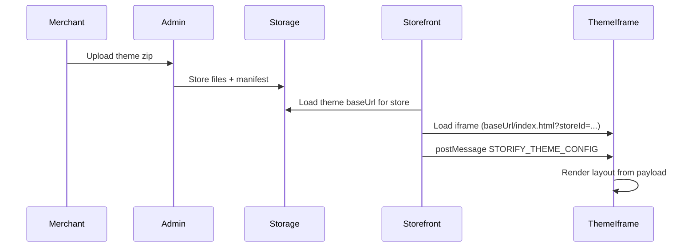

# Overview

## What is a Storify theme?

A **Storify theme** is a self-contained storefront UI (HTML, JS, CSS, and optionally a framework like React) that:

- Is defined by a **theme manifest** (`theme-manifest.json`) describing name, version, entry script, and **sections** (e.g. hero, featured products, footer).
- Can define **theme-level settings** (e.g. accent color, menus) and **per-section content** (e.g. title, image, CTA link) that merchants edit in the Storify theme editor.
- Is **uploaded as a zip** by the store owner (or you) via the admin panel and stored in the platform’s storage (e.g. Cloudflare R2).
- Is **loaded only on the storefront home page** inside an **iframe**. Other routes (e.g. `/shop`, `/product/:id`, `/checkout`, `/order-success`) are handled by the platform and are not replaced by your theme.

## How the theme is loaded

- When a store has an **uploaded theme** (a theme with a `baseUrl`), the storefront loads the **home page** by embedding an iframe.
- The iframe `src` is: `{themeBaseUrl}/index.html?storeId={storeId}` (and any other query params the platform adds).
- Your theme app runs inside this iframe. It does **not** need to fetch layout/settings from an API; the storefront sends a single **postMessage** with type `STORIFY_THEME_CONFIG` containing `layout`, `settings`, `storeId`, and `store` (store name, logo, favicon, etc.).

## Data flow (high level)

1. **Upload** — Merchant uploads a zip; backend validates `theme-manifest.json`, optionally merges `config/pages/*.json` into `pageDefaults`, stores all files under a theme prefix, and creates an `UploadedTheme` record with `baseUrl`.
2. **Activate** — Merchant clicks “Activate” (use) for a theme; backend builds default layout/pages from manifest + pageDefaults and saves theme instance config for that store.
3. **Storefront load** — Storefront gets theme + config (e.g. via bootstrap API); for home, it renders the iframe and posts `STORIFY_THEME_CONFIG` with current layout, settings, storeId, and store.
4. **Theme runtime** — Your theme loads the **Storefront SDK** from `payload.sdkScriptUrl` (platform serves it; do not bundle it), calls **StorifySDK.setStoreConfig** with storeId, store (currency, language), and apiBaseUrl, then filters enabled sections and renders. Use **window.StorifySDK** for all data and formatting; no custom API layer or SDK file in the theme zip.

## Routes: theme vs platform

| Route | Handled by |
|-------|------------|
| **Home** (`/`) | Your theme (iframe) when an uploaded theme is active. |
| `/shop`, `/product/:id`, `/wishlist`, `/track-order`, `/about`, `/contact`, `/profile`, `/policies/:slug` | Platform (fixed pages). |
| **`/checkout`** | Platform only (never replaced by theme). |
| **`/order-success`** | Platform only (never replaced by theme). |

So your theme code only needs to render the **home page** experience; checkout and order confirmation are always the platform’s pages.

## What you need to implement

- **Build output** that includes `theme-manifest.json` at the root and the file referenced by `entry` (e.g. `dist/assets/main-xxx.js`).
- **`index.html`** that loads your entry script and listens for `message` events.
- **Message handler** that loads the SDK from `payload.sdkScriptUrl` (if present), then calls **StorifySDK.setStoreConfig** with `id`, `currency`, `language`, and `apiBaseUrl`. Do not bundle the SDK in the theme.
- **Section renderer(s)** that map section `id` / `component` to your components and render using `content` and `settings`.
- **Data and formatting:** Use **window.StorifySDK** (getProducts, formatPrice, prepareProductDescription, cart, wishlist, reviews, etc.). You do **not** need a file named `storefront-sdk.ts` or any SDK file in your theme; the platform serves the SDK. Optionally copy the **theme-adapter** folder for one import (hooks and helpers); see [06-STOREFRONT-SDK.md](06-STOREFRONT-SDK.md).

Next: [02-MANIFEST.md](02-MANIFEST.md) for the full manifest reference.
