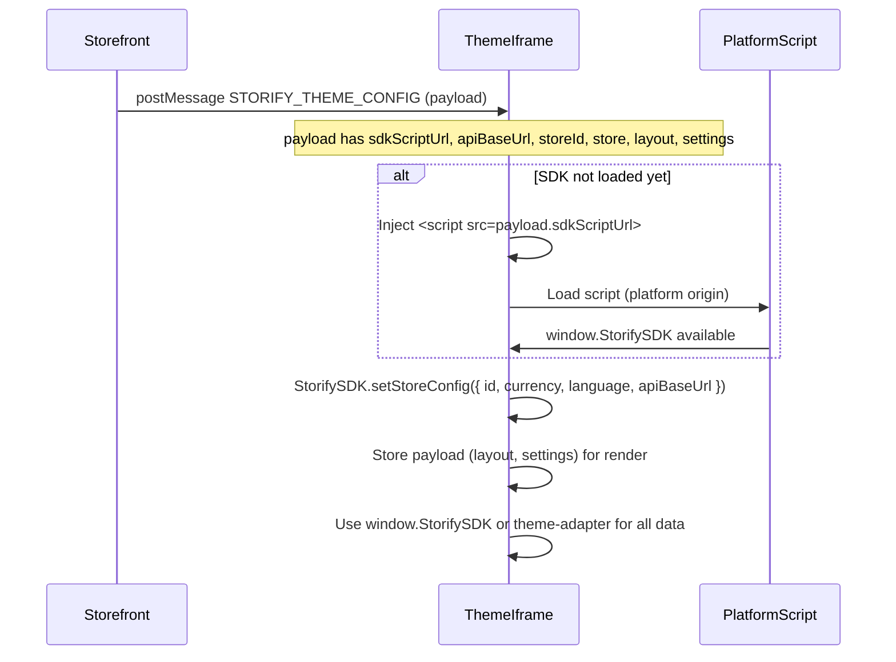

# Correct integration flow (بدل ملف SDK)

This page is the **single place** for how to connect your theme to the platform **without** shipping an SDK file. Follow these steps in order.

---

## Flow overview



---

## Step-by-step (الربط الصحيح)

### Step 1: Listen for the message

Subscribe to `message` and filter for `event.data?.type === 'STORIFY_THEME_CONFIG'` and `event.data.payload`. See payload shape in [05-RUNTIME-CONFIG.md](05-RUNTIME-CONFIG.md).

### Step 2: Load the SDK script (if needed)

- If `payload.sdkScriptUrl` is present and `window.StorifySDK` is **not** defined:
  - Create a `<script>` element with `src = payload.sdkScriptUrl`.
  - Append it to `document.head`.
  - Wait for the script’s `onload` (or use a small helper that resolves a Promise on load).
- If `window.StorifySDK` is already defined (e.g. second message after editor save), skip loading.

### Step 3: Call setStoreConfig

As soon as the SDK is available (after script load, or immediately if it was already there), call:

```js
window.StorifySDK.setStoreConfig({
  id: payload.storeId,
  currency: payload.store?.currency,
  language: payload.store?.language,
  apiBaseUrl: payload.apiBaseUrl,
});
```

This configures the store id, locale (for `formatPrice`), and API base URL for the cross-origin iframe. Call it **once per payload** (e.g. on first load and whenever the config message is received again).

### Step 4: Store the payload for layout/settings

Keep `payload.layout`, `payload.settings`, and any other fields you need in your app state so you can render sections and read theme settings (e.g. menu handles).

### Step 5: Use the SDK for all data and formatting

- **Either** use `window.StorifySDK` directly:  
  `StorifySDK.getProducts()`, `StorifySDK.getProduct(id)`, `StorifySDK.formatPrice(price)`, `StorifySDK.getMenu(handle)`, etc.
- **Or** copy the **theme-adapter** folder into your theme and import from it:  
  `useProduct`, `useCart`, `formatPrice`, `submitReview`, etc. The adapter still uses `window.StorifySDK` under the hood; no fetch or apiBaseUrl in your theme.

Full API list: [06-STOREFRONT-SDK.md](06-STOREFRONT-SDK.md#platform-sdk-api-windowstorifysdk).  
Complete code example for steps 1–4: [09-EXAMPLES.md](09-EXAMPLES.md) — Example A (Runtime listener).

---

## Do not do (لا تفعل)

| Do not | Instead |
|--------|--------|
| Add a file `storefront-sdk.ts` or `storefront-sdk.js` in your theme | Load the script from `payload.sdkScriptUrl` (platform serves it). |
| Add `constants.ts` (or similar) with `API_BASE_URL`, `STORE_ID`, etc. | Use `StorifySDK.setStoreConfig` once; the SDK uses `payload.storeId` and `payload.apiBaseUrl`. |
| Manually `fetch(…)` with `X-Store-Id` for products, menus, cart, reviews | Use `window.StorifySDK` (or theme-adapter) for all of these. |
| Use `toFixed(2)` or hardcoded currency for prices | Use `StorifySDK.formatPrice(price)`. |
| Use raw `dangerouslySetInnerHTML` with `product.description` | Use `StorifySDK.prepareProductDescription(html)`. |
| Implement your own wishlist/reviews API layer | Use `StorifySDK.getWishlist`, `toggleWishlist`, `getReviews`, `addReview` (or theme-adapter equivalents). |

---

## Checklist

- [ ] Theme listens for `STORIFY_THEME_CONFIG`.
- [ ] If `payload.sdkScriptUrl` and no `window.StorifySDK`, inject script and wait for load.
- [ ] Call `StorifySDK.setStoreConfig({ id, currency, language, apiBaseUrl })` with payload values.
- [ ] Use only `window.StorifySDK` (or theme-adapter) for products, menus, cart, wishlist, reviews, formatPrice, prepareProductDescription.
- [ ] No `storefront-sdk.ts` (or any SDK file) in the theme zip.
- [ ] No `constants.ts` or custom API layer with apiBaseUrl / X-Store-Id.

---

## See also

- [05-RUNTIME-CONFIG.md](05-RUNTIME-CONFIG.md) — Payload shape and optional fields.
- [06-STOREFRONT-SDK.md](06-STOREFRONT-SDK.md) — Platform SDK API and theme-adapter.
- [09-EXAMPLES.md](09-EXAMPLES.md) — Example A (listener + script load + setStoreConfig), E, E2, G, H.
